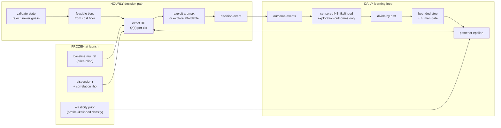
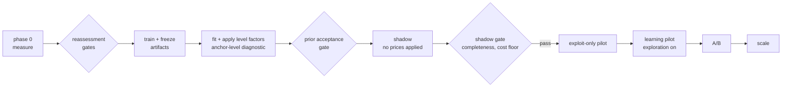
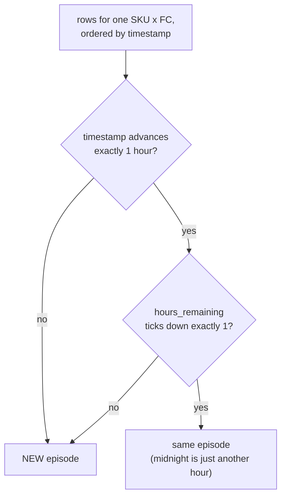

# Perishable Markdown MVP — System Design

**Status:** Implemented; validated on production FLC data after the section 12a data-definition corrections; calibration and shadow gates PASSED (model `baseline-20260809120225`)
**Standing:** The authoritative specification. The original PRD is retired (its normative content lives here; the history of what it specified and what replaced it is in `docs/learnings.md`)
**Audience:** Technical leadership review — this document is self-contained and requires no companion reading

---

## 1. Executive summary

This system prices perishable FLC (fresh-limited-clearance) inventory through
its final selling window, replacing a legacy policy that ramps discounts
deterministically ~1 percentage point per hour on the clock. It minimises
**Inventory Loss (IL)** — discount given away on units sold, plus scrap cost
on units unsold at expiry — running at **32.3% of full-price sales value**
on the replay sample of 2,000 episodes.

The central technical fact shaping the design: **price elasticity cannot be
estimated from our own history.** The legacy ramp makes price collinear with
hour-of-day, and our bootstrap analysis surfaced a second, subtler confound
(within-episode survivorship — section 3.2). Any system that claims to have
learned price response from this data has actually learned the clock. The
design therefore uses history only for what it can support — baseline demand,
demand variance, correlation structure — and learns elasticity **in
production**, from deliberately randomized price perturbations whose total
cost is capped at **1% of markdown IL** per day.

Current state: the pipeline has been exercised end-to-end on production data
through four bootstrap iterations, each of which caught and fixed a real
defect (section 7). The demand model now carries per-SKU velocity features,
and the calibration process surfaced a measured fact about the business:
weekly demand levels swing ±8% around a persistent baseline deficit, so the
fidelity gate band was reset by the owner to [0.90, 1.10] (~2σ of the
measured 3-week noise) with the daily drift ratio as the continuous guard.
The calibrated model clears that gate (`level_bias_at_anchor` **1.0389**),
and the shadow phase has run to completion on live data with no prices
applied — 12,771 decisions, event completeness 0.9974, zero cost-floor
violations. Under the same demand model the planner shows **38.0% less
Inventory Loss** than the legacy ramp for **0.97pp** of clearance. Two
stop-condition thresholds and the A/B minimum detectable effect (section 12)
remain open owner decisions; they are the only things between here and the
exploit-only pilot.

The honest risk summary: the *safety* engineering is strong (a below-cost or
rising price is structurally impossible, not merely checked for; every gate
that has fired so far fired correctly and caught a real problem). The open
question is the *speed* of the learning loop within the 13-week MVP window —
quantified in the risk register (section 13), with the shadow phase designed
to answer it before any price is applied.

---

## 2. Business context and objective

### 2.1 The problem

Each perishable SKU at each fulfilment centre gets one final selling window —
one **episode**: a run of contiguous selling hours for one SKU × FC, with
small starting inventory (median ≈ 2 units). Windows are **not** a single
trading day — they routinely run past midnight, and 36-hour windows are
common, which is why an episode is keyed by the source's own window counter
rather than by calendar date (section 12a). Each hour, a discount is chosen;
whatever is unsold when the window closes is scrapped at cost.
Price too shallow and scrap dominates; too deep and margin is given away on
units that would have sold anyway. The legacy policy ignores demand entirely:
enter at a fixed reference discount, deepen ~1pp/hour to a cap.

### 2.2 What the system optimises

The planner minimises expected **absolute Inventory Loss** per episode:

```
IL = Σ over hours (original_price − applied_price) × units_sold   ← discount cost
   + cost × unsold_inventory_at_expiry                            ← scrap cost
```

Absolute IL is the currency amount the business is accountable for, and it is
additive across hours — which makes it a valid dynamic-programming reward
with no transformation.

### 2.3 What the business reads — and why the two can disagree

The headline reporting metric is **IL% = IL / (original_price ×
units_sold)** — loss over the full-price value of what actually sold. Its
denominator is **endogenous**: deeper markdowns sell more units and enlarge
it. Minimising IL and minimising IL% are therefore *different optimisations*.
A worked example (original price 10,000, cost 2,000, 10 units, fixed
horizon):

| Policy | Price | Units sold | IL | Denominator | IL% |
| --- | --- | --- | --- | --- | --- |
| A | 9,000 | 4 | 16,000 | 40,000 | **40.0%** |
| B | 7,000 | 8 | 28,000 | 80,000 | **35.0%** |

The planner chooses A (16,000 of loss beats 28,000); IL% prefers B. The
divergence is widest on low-cost SKUs, where scrap savings are small and the
denominator effect dominates. This is a deliberate decision: a ratio
objective can be "improved" by discounting harder purely to grow its own
denominator, which is not behaviour a planner should learn. The consequence
is stated plainly rather than discovered later: **the A/B will be read on a
metric the planner does not optimise**, the likeliest outcome is "absolute IL
improved, IL% roughly flat", and the decision rule for that case is
pre-committed (section 11.2) rather than left to whoever reads the dashboard.

Reporting discipline that follows from the endogenous denominator:

- Aggregation is **always a ratio of sums** (Σ IL / Σ denominator).
  Per-episode IL% is undefined for zero-sale episodes — which are ~12% of
  episodes, not an edge case — and is never computed or averaged.
- Every IL% figure is reported **with its denominator**, so a sales-mix shift
  is distinguishable from a pricing-performance shift, and **absolute IL is
  reported alongside** in every cut (total, category, FC, A/B arm).

### 2.4 Learning rate is the product

The system's value is not its day-one policy — it is that the policy improves
from its own decisions. Learning time scales with the number of
independently-estimated cells and with the volume of usable evidence, so the
MVP deliberately cuts anything that slows learning without protecting money:
subcategory-level learning (100+ cells vs ~10), Thompson sampling (redundant
with budgeted exploration, and a known defect source in a predecessor),
weekly model retraining (confounds learning with drift), deployment
machinery for things that don't change, stochastic replay rollouts (the A/B
is the evidence; replay is a sanity check).

---

## 3. The identification problem

**History predicts demand. It cannot identify price response.** Those are
different jobs, and the distinction is the reason this system exists in the
shape it does.

Almost everything the planner needs comes from history and transfers cleanly:
demand level by SKU, category and FC; hour-of-day shape; day-of-week and
seasonality; per-SKU velocity; the negative-binomial dispersion `r`; the
intra-episode correlation `rho`. All of it is fit offline, frozen, and used in
production. Section 5 is largely an account of *what history can support*.

Exactly one quantity does not transfer: the **price → demand slope**. Not
because the data is small or dirty, but because **price was never a free
variable in it**. Every price in the history was produced by the legacy rule —
enter at the reference discount, ramp ~1pp/hour to a cap — so price is a
deterministic function of the clock, and a deep-discount row exists only
because earlier hours failed to sell. Price, hour, and "this episode is
already failing" are the same column of numbers.

This is the standard distinction between **prediction** and **causal
identification**. History is excellent at predicting what happens *under the
policy that generated it*. It is silent about what happens under a *different*
policy, unless the policy variable was varied independently of everything
else. We are proposing a different policy, so that is exactly the question it
cannot answer.

Two consequences follow, and both matter operationally:

- **More history does not help.** The bias is a property of how the data was
  generated, not of the sample size. Ten years of the same ramp is ten years
  of the same confound, so "collect more data first" is not a route to an
  answer.
- **Randomisation is the only route.** Prices chosen independently of state
  break the rule's grip on the price column. One day of randomised prices
  identifies ε better than five months of history, because it is the only data
  in which price was not set by a rule. That is why exploration is a budgeted
  P&L line rather than a nice-to-have: it is the sole supply of the one number
  the planner needs and history structurally cannot provide.

### 3.1 The clock confound

Under the legacy ramp, the discount deepens as the evening demand peak
arrives. Within an episode, price and hour move in lock-step (correlation
≈ 0.8). Demand lift from the evening is statistically indistinguishable from
demand lift from the discount. History can *bound* elasticity; it cannot
point-identify it.

### 3.2 The survivorship confound (found during bootstrap, not in the original analysis)

There is a second trap: under the ramp, an observation at a deep discount
exists *only because* earlier hours failed to sell — deep-discount rows are
adversely selected toward low-demand episodes. Fitting elasticity on all
rows drags every estimate toward zero ("discounts don't seem to help"),
which we observed directly: all sixteen categories initially pinned at the
zero-side boundary of the search grid. The fix is to identify only from
**entry-hour variation across episodes** (different episodes start at
different hours and are truncated differently by the cost floor), never from
adjacent hours within an episode. After that fix the boundary pinning
stopped — the estimates moved into the interior, evidence the mechanism and
not the data was the problem. They still do not survive the acceptance
checks: where a category's data cannot identify ε (section 9.3), its cell
launches on the wide pooled or uniform density instead of a sharp guess.

### 3.3 How the design responds

1. **The demand model never exposes a price gradient.** The baseline predicts
   demand *only at the category reference discount* — at inference its price
   features are overwritten to that anchor — so whatever price-hour artifact
   it absorbed in training is never queried. Price response enters through
   exactly one learned scalar per category:
   `mu(d) = mu_ref × ((1−d)/(1−d_ref))^ε`.
2. **History contributes a density, not an estimate** (section 5.6):
   the censored profile likelihood itself, deff-deflated and read as a
   density per category — sharp where the data identifies ε, degrading to
   the pooled or uniform density where it does not. A wide density is a
   designed outcome, not a failure.
3. **Truth comes from production randomization** (section 5.8): a small,
   costed, uniformly-randomized set of price perturbations whose outcomes
   are the only evidence the learner consumes.

### 3.4 Why the cold-start elasticity is not fitted to history

The obvious shortcut — pick the ε where `mu_ref × ratio^ε` best fits
history — deserves a direct answer, because it *was* run, in its most
defensible form: proper censored likelihood, per category, restricted to the
cleanest identifying slice (entry hours). That is exactly what the prior
procedure computes, and its output is the argument against trusting it. On
production data, DAIRY's best-fit ε was **−0.10 under one defensible
specification and −3.05 under another** — a 30× swing on a single modelling
choice; BAKERY's "estimate" sat pinned at the search bound (an optimiser
reporting its cage, not the customer); and the implied direction *inverted*
between model versions. A best-fit ε is unstable because the likelihood
optimum is set by whatever variation dominates the data — the clock,
survivorship, weekly demand shocks — not by price response.

The trap makes it worse than useless: a fitted ε would make the offline
replay look excellent, because it fits the residual by construction — and
then the planner prices with it. If the fit absorbed "deep discounts
coincide with items that don't sell" (survivorship), the DP concludes
markdowns are futile, holds price, and burns scrap: the exact under-clearing
failure the calibration gate exists to prevent, induced by the number that
made the gate green. Optimising replay optics with ε is how a pricing
system fails while its dashboard smiles.

What history legitimately contributes is therefore bounded: sharp densities
where the data supports them, and the wide pooled or uniform density —
neutral and cheap to correct — where it does not. The wide std is not resignation
— it deliberately holds the exploration budget at full scale, so **the
first weeks of the learning pilot are themselves the ε fit**, run on
randomized data where the optimum finally means price response, at a cost
capped at 1% of markdown IL per day.

---

## 4. Architecture overview

```
FROZEN (fit offline, unchanged during the MVP window)
  baseline_model.txt      demand at the reference discount, by context
  feature_schema.json     feature order and categorical levels
  calibration.json        per-category level factors (always fitted AND applied — owner, 2026-08-25)
  r_lookup.json           negative-binomial dispersion by subcategory
  rho.json                intra-episode demand correlation (one scalar)
  prior.json              elasticity prior: a density per category, with
                          its own design and held-out comparisons

LEARNING (the only thing that updates in production)
  posterior.json          elasticity by cell {mean, std, n_obs, information,
                          version} + processed-outcome ledger (atomic)

DECISION PATH (per hourly decision interval)
  state ── validate (reject, never an unsafe price)
        ──▶ feasible discount tiers, constructed from the cost floor
        ──▶ exact DP: expected IL for every tier
        ──▶ exploit the argmax | explore the affordable set
        ──▶ price ──▶ decision event (~30 fields)
                          │
                 finalized outcome event
                          │
        censored NB update, correlation-deflated, bounded step,
        human-gated ──▶ posterior
```

Three properties worth stating up front:

- **Safety is structural.** The action set is built from the cost floor and
  the price-monotonicity anchor; a below-cost or rising price is
  *unrepresentable*, on every path including forced exploration.
- **Evidence is append-only and versioned.** Every decision event carries the
  exact demand prediction, posterior moments, and artifact versions it used;
  learning replays from events, never from recomputation.
- **Exactly one thing learns.** Everything else is frozen so that posterior
  movement is attributable to learning, not drift.

---

## 5. Component deep-dive — what each part does, and why

### 5.1 Configuration — one tuning surface

Every threshold, window, rate, and bound lives in a single `config.yaml`;
code contains no numeric literals for anything tunable, and adding a tunable
to code without adding it to config is defined as a review failure. **Why:**
pricing systems die by configuration drift — a constant tuned in one module,
a stale copy in another, and a post-incident review that cannot reconstruct
what was actually running. One file gives the operator a complete review
surface, and the strict-mode loader *refuses to start* while any measured or
owner-decided value is null — the system cannot silently run on a guessed
parameter. Every value is labelled by provenance: `MEASURED` (produced by
the bootstrap pipeline), `SET` (design choice), or `SET BY OWNER` (business
decision), so responsibility for every number is explicit. The six
runtime-required values `load_config(strict=True)` refuses on while null:
`dispersion.rho`, `dispersion.mean_forced_hours_per_episode`,
`exploration.tau_initial` (from shadow's `tau_initial_derivation`),
`monitoring.stop_conditions.scrap_deterioration_pct` and
`margin_deterioration_pct`, and `ab_test.min_detectable_effect_pct`.
MEASURED values are pasted into `config.yaml` by hand from their one source;
SET BY OWNER values come from the product owner only — **an agent must never
invent them**. And the boundary of the surface: config is the source of
every *tunable* and of no *secret* — credentials live in `~/.env` and reach
code as `REDSHIFT_*` environment variables; no hostname, credential, or
connection string goes in `config.yaml`, in a module, or in a commit.

### 5.2 Data preparation — schema mapping and filter chain

Applies the source-to-canonical column mapping exactly once, converts the
discount column from percent to fraction exactly once, builds episodes as
contiguous windows, and runs a fixed filter chain, emitting a row/episode
waterfall after every step. **Almost every filter drops the whole episode
rather than the offending row** — a hole punched mid-window re-segments into
a spurious short episode, which loses more than the episode does.

**Only integrity and scope rules drop.** A stage removes an episode when its
rows cannot be believed, cannot be used by anything at all, or fall outside
the period the study covers. Nothing is dropped for being hard to *price* —
those conditions are flags, because `FEATURES` carries neither `cost` nor
`hours_remaining` nor anything about the inventory chain, so the demand model
cannot see them and such an episode is an ordinary observation to every frozen
artifact. Dropping them removed **>70% of the extract's COGS** from every fit.
The transferable rule: **never gate on a condition a constraint already
handles** — ask what actually happens if the row stays; a loud refusal
counted in a report is usually better than a silent removal upstream.

| Step | Drops |
| --- | --- |
| `duplicate_hour_rows_dropped` | both copies of any repeated (SKU, FC, hour) — no principled way to choose, and they collide two runs into one episode id |
| `gap_split_windows_dropped` | **every fragment** of a source window a missing hour split in two. Neither fragment is an episode: the first ends unclosed, the second opens mid-window with the wrong starting stock, a counter part-way down, and a first row that reads as an ENTRY row — which `estimate_prior` fits elasticity on. Detected from the counter, which across a gap falls in step with the clock; a genuinely new window resets it upward |
| `exclusion_window_removed` | any episode with *any* hour in the known bad-data window. Scope, not integrity: the rows are fine, the period is not |
| `discount_out_of_range_dropped` | discount outside [0,1] — the percent→fraction conversion applied twice or not at all |
| `negative_quantities_dropped` | impossible quantities: negative inventory or sales. **Not `cost <= 0`** — that is the `cost_missing` flag |
| `null_category_dropped` | no category/subcategory — no reference discount, no dispersion cell |
| `zero_base_price_dropped` | `original_price` still absent after fill-within-episode |
| `episode_universe` | the three conditions that make an episode's inventory readable, evaluated once and before any filter with an opinion about price, category or cost: CONTINUITY (`ending[t] == starting[t+1]`, the only one that drops), the IDENTITY (`opening + restocked == sold + scrap`, a guard on the arithmetic since continuity makes it provable), and a CLEAN CLOSE (`starting >= sold` on the last row, which flags `final_hour_restock`). An hour-level restock or shrink is neither: both are real events, counted gross and settled at the episode level |
| `contiguous_episodes_built` | *(not a filter)* re-segmentation, and a NO-OP that RAISES if it stops being one — every drop after the ids are assigned is episode-scoped, so nothing punches a hole in a window |
| `negative_window_recovered` | *(not a filter)* "manufacturing" SKUs enter with a counter that is **already negative** — a large negative constant, not a countdown from the window length. Dropping them is not neutral: they are concentrated in a few categories, so it selects on category and biases every per-category figure. Measured on production, 381,805 of 384,055 such episodes (**99.4%**) resolve inside `data.manufacturing_window_hours` (**24**), so those get a synthetic countdown `(cap−1) − position`. A countdown, never a clamp: the counter drives episode identification, the DP horizon, and `extend_to_window`, and a flat counter re-segments every hour. The 2,250 that run longer are **not** recovered and carry the `negative_window` flag instead, with their count reported. **Runs after re-segmentation**, because it is the only step that mutates `hours_remaining` — the field the ids are derived from — and its synthetic countdown can otherwise line up with a genuine neighbouring window and merge the two |
| `eligible` | *(not a filter — a GATE)* `accounting_closes & final_hour_clean & closed`. The population the demand model and the frozen artifacts read (when `baseline_model.train_population` is `eligible`), and the one every scrap / IL / clearance figure reads unconditionally — `scrap_units` returns NaN outside it |
| `dp_eligible` | *(not a filter — a GATE)* how much of the surviving population the DP can act on, with the per-flag breakdown in its detail block. Read by the DP solver, the backtest, shadow, the calibration gate and the A/B |

`tag_dp_eligibility` then flags, on the surviving frame. Six conditions gate
`dp_eligible`, each naming something the *solver* cannot do; an episode is
labelled with the first it trips.

| Flag | Why the DP cannot act on it |
| --- | --- |
| `cost_missing` | `cost <= 0` — a *missing* cost, not a free good, and the `=` is load-bearing. At zero cost `non_priceable` reads `d_max = 1.0` (*maximally* priceable), a 100% discount enters the action set, and `mu(d) = mu_ref · ((1−d)/(1−d_ref))^ε` at `d = 1` is `0 ** negative` — a `ZeroDivisionError` out of `pricing.demand`. Quieter and worse: scrap is `cost × leftover`, so zero-cost episodes contributed discount cost and **no scrap at all**, deflating every IL figure over them. The fix is two layers on purpose and neither makes the other redundant: `pricing.dp.feasible_tiers` excludes any tier whose price is not strictly positive (that layer owns "which prices are legal" and must not depend on an upstream filter), and this flag keeps unknown-cost episodes out of every DP-side number — the flag cannot protect a production caller, and the tier rule cannot un-deflate an IL baseline. `m6_il_pct` excludes `cost <= 0` from BOTH of its `by_population` bases. The bug surfaced only from `pipeline.shadow --max-episodes 0`: the 3,000-episode default had never drawn a zero-cost episode, so **the gate passed on a sample that hid a crash** — quote the sampling caveat for more than the violation count |
| `non_priceable` | `cost >= original_price`, so `d_max <= 0` and `feasible_tiers` is EMPTY |
| `negative_window` | `hours_remaining` still `< 0` after recovery — the DP takes its horizon from the counter and `extend_to_window` builds the synthetic tail from it |
| `window_too_long` | above `data.max_window_hours` (**120** — raised from 48 by the owner: 48 was cutting legitimate multi-day windows, not only upstream defects) — `extend_to_window` RAISES above the cap, so this is a crash rather than a refusal. The bad value is dropped, never clamped: clamping would invent a window end the data never recorded, and the counter is load-bearing three ways (episode identification, the DP horizon, the synthetic tail) |
| `outcome_unknown` | the episode never closed inside this data. Gates `eligible` as well: an unfinished episode is not a complete observation of anything, and two consumers silently mis-weighted one before this existed |
| `final_hour_restock` | the last row sold more than it opened with, so stock arrived during the close and the leftover is a guess. Gates `eligible` too |

Four conditions are flagged and gate nothing:

| Flag | Why it does not gate |
| --- | --- |
| `below_cost_hours` | a price the LEGACY policy set, which the agent is constrained never to set. No harness special-cases it: the backtest's DP arm is **self-anchored** (`anchor = d_t`, its own previous choice) and never sees the legacy price; in shadow the legacy price IS the anchor, so from the crossing hour the action set is empty and `validate_state` refuses every remaining hour — the cost floor working, counted in `rejected_reasons` — while the hours *before* the crossing are good decisions the old chain deleted with the episode. Test below-cost as `original_price × (1 − discount)`, NEVER `applied_price` (zeroed on ~78% of rows). These episodes carry the widest price spread the extract has, which the elasticity prior is otherwise starved of |
| `edge_truncated` | of the unfinished episodes, the ones the extract boundary explains — the diagnostic that says whether the count is the boundary or a feed problem. It has an expected magnitude: only the extract's last hours can leave an episode unfinished (`window_slice` assigns episodes whole by opening date), so a 175-day extract of ~36h windows should read under 1% — production measured 3.38%, above expectation |
| `restocked` | units arrived mid-window. Does NOT gate: the replay re-solves hourly and applies the episode's own per-hour adjustment, so the DP meets an arrival exactly as it does live |
| `shrink` | units left unsold and unwritten-off. Does NOT gate: they are counted into scrap, so `supply == sold + scrap` still closes. `unreconciled_anomalies` in the split manifest locates shrink episodes by category and month for business deep-dive — a report, not a gate |

The episode-level stock invariant is against SUPPLY, not opening stock:
`sold <= opening + restocked`, following from the identity (scrap is
non-negative) rather than from any filter;
`test_prepared_data_is_priceable_and_self_consistent` asserts it on the
output. The older opening-stock form was simply false once restocked
episodes stopped being excluded — 13 episodes tripped it, every one
correctly. The other postconditions asserted by test rather than assumed:
discount in [0,1], non-negative quantities, `d_max > 0`, category present,
no hour inside the exclusion window, `hours_remaining` within the cap, a
monotone window counter inside every episode.

The negative-window cap is a claim about the data and the stage *checks* it:
an episode entering negative that runs longer than the cap is not recovered
— it is flagged `negative_window` and counted as
`episodes_entering_negative_but_longer_than_cap`. **If that count is not
near-zero on your extract, the cap is wrong — fix the cap, do not widen the
recovery.** The run-after-re-segmentation ordering above is not cosmetic:
run first, the synthetic countdown once lined up with a genuine neighbouring
window on the production extract (165 rows) and merged the two, and the
invariant assertion misreported it as "a filter is dropping rows" — the one
explanation that could not be true, since every drop is
`isin(episode_id)`-scoped. Do not move it back. `negative_window_recovered`
is also the **last** `hard_drop` row, so its counts ARE the `integrity`
population; `episode_universe` runs *before* re-segmentation, so a future
row-scoped filter would leave its continuity check and every id-keyed flag
silently stale — which is why re-segmentation is an assertion, not a bare
recompute.

`eligible` — the middle population — is **three conditions and no more**, all
evaluated in `common.episodes.episode_flow` and exposed as one column:
`accounting_closes` (the identity `opening + restocked == sold + scrap`
balances), `final_hour_clean` (`starting − sold >= 0` on the last row), and
`closed` (`ending_inventory == 0` on the last row). All three were live
before; closure used to be re-derived independently at each consumer, which is
one chance per consumer to forget it, and two did.

The middle tier exists because of the censored likelihood, which corrects
the earlier "FEATURES cannot see the chain, so nothing matters" argument in
one place: the likelihood treats an hour as censored when the shelf ran out,
and **that call is read off the inventory** — an ambiguous final hour means
an untrustworthy censoring flag, and a wrong censoring flag biases demand
directly. Everything `dp_eligible` additionally rejects (missing cost,
unreadable horizon, mid-window restock or shrink) really is invisible to the
model, so those episodes stay in `eligible`. `integrity` — everything that
survived the chain, "rows that can be believed" — is read by nothing by
default. The prepared frame carries `units_restocked`, `units_shrink`,
`episode_supply`, `episode_scrap`, `episode_clearance`, `final_hour_clean`,
`outcome_known` and `episode_eligible`; the reason column is
`dp_ineligible_reason`, set to the FIRST flag tripped so it reads as a
cause.

Which population a consumer reads is one decision, in
`baseline_model.train_population` (default **`eligible`**), resolved through
`prepare_data.population(d, cfg[, which])` — always call it, never re-derive
the filter. The three artifact fits read the config; the DP, the
calibration gate, the backtest, shadow, `tau` and the A/B always pass
`"dp_eligible"` explicitly, because for them it is a precondition, not a
choice — the DP has no feasible tier otherwise, and `extend_to_window`
refuses a counter above the cap. Two population facts are fixed: `m1` /
gate 1 reads `integrity` always (on `dp_eligible` it reads ~0 by
construction and cannot fail), and `m6` IL% reports `by_population` on both
bases — integrity is what the business loses, `dp_eligible` what the MVP
addresses. Choosing between train populations is a **two-run comparison**,
not a field in one report: flip `train_population`, re-run, compare
`calibration_gate_value` (on `dp_eligible` either way); the backtest stamps
`artifact_versions.train_population` so the two reports cannot be confused.

Every stage also reports **`cogs_at_risk`** — unit cost × **supply** (opening stock plus gross arrivals; owner, 2026-08-24 — opening stock alone understated every restocked episode, and `tools.eda`'s clearance panel had already made the same correction for its own denominator),
counted once per episode — with `cogs_dropped` and `cogs_dropped_pct_of_raw`
beside it. Rows are not the unit the business cares about: IL is discount
given away plus scrap at cost, so what a filter costs is exposure, and the two
measures diverge. A stage can take 1% of rows and 15% of the money, and only
the second figure says whether the surviving population still represents the
business. `cogs_dropped` is negative at exactly one stage — see below.

`contiguous_episodes_built` runs between the row-level and episode-level
passes and is **not** a filter: episode count can *rise* there, because
earlier drops split windows that were contiguous in the raw extract. The
waterfall in `artifacts/split_manifest.json` records rows and episodes after
every step, in this order. **Why the paranoia:** the three source-schema traps all
fail *silently*. A missed percent conversion produces discounts of 25.0
instead of 0.25 with no error anywhere downstream. The realised-price column
is 0 on zero-sale rows — reconstructing offered price from it silently
drops every zero-sale hour, which is ~78% of rows and precisely the
population carrying the demand signal at shallow discounts. And the source
has no episode ID, so the construction rule is persisted alongside the data
splits — production and evaluation must derive identical episode boundaries
or every episode-level metric diverges unauditably. The waterfall exists
because a filter chain that cannot show what it dropped, in order, cannot
be reviewed.

The chain is **13 waterfall rows**, the first being `raw` (the starting
count before any drop). Every row carries `kind` and `used_by`: read
`used_by` before quoting a row as "the data we trained on" — the two
`population_gate` rows are the only place the consumers diverge.
`python3 -m tools.export_waterfall --input <raw>.parquet` writes the whole
chain as a workbook: the stages with `kind` and `used_by`, three WHOLE
example episodes per removal reason drawn from the raw feed, then every rule
in prose. The example ids are emitted by `load_and_filter` itself as it
drops them — an exporter re-deriving which episodes a filter removed would
be a second copy of the chain, disagreeing silently in the document meant to
establish trust.

Only `bootstrap.measure` and `bootstrap.prepare_data` accept raw data —
never feed raw to a module that expects `data/prepared.parquet` (the
percent→fraction conversion happens exactly once, here). A prepared parquet
predating the SKU rate feature set fails prediction with a clear error —
re-run `prepare_data` before retraining.

### 5.3 Historical measurement — measure first, then build

Before any component was built, a measurement pass produced every value the
design needs but must not guess: cost-ratio distributions (is exploration
even feasible under the cost floor?), same-hour price variation (is a prior
estimable at all?), demand density and censoring shares, intra-episode
correlation, per-category weekly volumes, and the A/B variance. **Why:**
each of these, guessed wrong, produces a system that is confidently wrong in
a specific way — e.g. assuming independent hourly evidence declares learning
converged four times too early (section 5.11). Three measurement outcomes
were designated in advance as *design-changing* rather than parameterising
(non-explorable catalogue → scope shrinks; no identifying variation → prior
falls back; A/B variance too high → duration or effect size must change), and
those decisions were made by humans against the measured numbers, not
absorbed silently.

### 5.4 Baseline demand model — frozen, and blind to price

A gradient-boosted tree model (LightGBM) with a Tweedie objective predicts
units sold per hour. Features: category, subcategory, FC, hour of day, day
of week, day of month, base price, two point-in-time SKU demand rates
(below) — and a **single** price feature that is **overwritten to the
category reference discount at every inference call**. **Why Tweedie:**
hourly perishable demand is a zero-heavy count (~78% zeros) with a positive
tail; Tweedie's point mass at zero fits this shape where squared-error
under-predicts and Poisson under-disperses. **Why the price-feature
overwrite is the load-bearing trick:** the model trains on confounded
history and would happily learn the price-hour artifact — but its price
gradient is *never queried*. It answers only "what is demand at the
reference discount in this context"; price response enters exclusively
through the learned elasticity scalar. One price feature means one
overwrite point, which is auditable; the legacy model's four
(depth, entry, incremental, discount×hour) were four places for the
confound to leak. **Why frozen for the whole MVP window:** if the model
retrains while the posterior learns, posterior movement cannot be
attributed — it could be learning or drift. Freezing buys attribution and
costs drift risk, which is accepted, monitored daily (section 5.11), and
bounded by the window end date. Freezing is a phase, not a posture: once the
experiment has read out there is nothing left to attribute, and the baseline
returns to an ordinary retraining cadence with the level factors tracking
drift between retrains. A per-subcategory multiplicative correction
factor is fitted and **always applied** (owner, 2026-08-25). It cannot mask
a slope error: factors are fit on anchor rows only, where the price term is
1 by construction, and the slope stays visible through
`slope_ratio_by_discount_gap` — a slope deficit is fixed by re-estimating
the prior or by learning, never by the level multiplier (section 9.2).

**The SKU demand-rate features.** The model's largest historical error was
level bias, and its most plausible cause is that category/subcategory/FC
alone cannot express per-SKU velocity (a few SKUs move far faster than
their category mean). Two features supply it, both **price-standardised**
— built only from *anchor hours*, stocked hours priced within one tier of
the reference discount, so they measure "how fast does this SKU sell at
reference conditions" regardless of which policy produced the price — and
both **point-in-time**, lagged strictly before the episode's date:

- `sku_ref_sales_rate_30d` — trailing [t−30, t−1] anchor-hour sales rate at
  **SKU × FC** grain (the episode grain; store traffic differs by FC), with
  a SKU-pooled fallback for sparse combinations (aggregated to SKU-day
  first, so no same-day cross-FC sales enter the window) and native-missing
  (NaN) when even that is empty — "no data" is never conflated with
  "doesn't sell".
- `prior_episode_ref_sales_rate` — the anchor-hour rate of the same
  SKU × FC's most recent previous episode: the recency signal on top of the
  30-day level signal. NaN if that episode had no anchor hours — purity
  over coverage.

Censored hours are included capped, matching the censoring the training
target itself carries. The residual caveat is a slow cross-day feedback
loop (in production these rates are computed from sales under our own
pricing); the anchor restriction is what keeps it tame.

**The training label is censored, and that is a priced trade.**

The target is `units_sold`, which stops at the shelf: an hour that sold out
records what fitted, not what customers wanted. Three options, one chosen:

- *Drop the censored hours.* Rejected — it selects on the outcome. Sell-outs
  are **14% of rows** and they concentrate in the later hours of a window,
  which is exactly when the selling happens. Training on what is left means
  training on a population reweighted toward the quiet part of the window.
- *Fit a censored likelihood* (a sold-out hour entering as `D >= q`). This is
  the principled answer and is what every other estimator here already does —
  `fit_dispersion`, `estimate_prior`, and the posterior update all carry the
  survival term. It is **not off-the-shelf under a Tweedie objective**:
  custom likelihood work plus its own validation, which the MVP did not buy.
- *Keep the label and correct the level.* Chosen. The bias is real and
  measurable — on the pre-calibration model the hourly bias runs −0.09 across
  uncensored hours against −0.21 once censored hours are counted, so the
  under-prediction roughly doubles when the unobservable hours are the busy
  ones.

What makes that trade safe is the feature exclusion below: with no inventory
or stockout indicator, the model cannot learn *"the shelf was empty"* and so
the censoring bias arrives smooth rather than structured — which is precisely
the shape a single multiplicative level factor can remove. **Section 5.4's
level calibration is therefore not housekeeping; it is the second half of
this decision**, and it is why that factor must be solved on the censored
basis (§9.3) rather than divided out: a correction for censoring cannot be
found on a basis that ignores censoring.

Revisiting it is a phase-2 item: a proper censored objective removes the need
for the level factor to carry this particular load.

**What is deliberately NOT a feature — and why.**

- *Hours remaining* is planner state, not demand context: the customer sees
  the shelf and the price, not our countdown. The DP keeps the horizon; the
  demand model does not (it is nearly collinear with hour-of-day anyway).
- *Within-episode lag sales* (`last_1hr`, `last_3hr`) were the legacy
  model's momentum features, and their exclusion is a priced trade, not an
  oversight. They are **post-treatment mediators** of the episode's own
  price path: a deeper price at hour t raises sales at t, which raises the
  lag feature at t+1, which raises the prediction — so part of the price
  effect is routed *through* the feature and the learned elasticity is no
  longer the price response. No inference-time overwrite fixes this,
  because training already attributed price response to the lag. (At median
  inventory ~2 they are also mostly a censoring indicator.) The
  cross-episode rates above are different in kind — yesterday's sales
  cannot be caused by today's price, and their anchor-restricted
  construction removes the pricing-level contamination; no such
  construction exists for within-episode lags, because under a ramping
  policy mid-episode hours are never at reference. Genuine momentum
  ("customers are discovering this item now") has a principled vehicle in
  phase 2: observe within-episode sales, divide out the price effect using
  the current elasticity, and update a **price-free multiplicative
  episode-level demand factor** applied symmetrically at every candidate
  price — momentum without corrupting the counterfactual.
- *Inventory, cost, stockout indicators* belong to the planner state and
  the censoring logic; as features they teach "low stock predicts low
  sales", which is the censoring artifact, not demand.

### 5.5 Dispersion and correlation — frozen variance structure

Demand is modelled negative-binomial: `Var[D] = mu + mu²/r`. The dispersion
`r` is fitted per subcategory by censored maximum likelihood on the
calibration weeks, with a fallback chain (subcategory → category → global)
for thin groups and a clamp on implausibly-high converged values. **An `r`
at the search ceiling has two causes wanting opposite treatment**: a thin
group whose MLE wandered there wants the clamp
(`dispersion.clamp_percentile`); a group genuinely steadier than Poisson
also lands there — no NB can represent it, `Var = mu + mu²/r` being at least
`mu` for every finite `r` — and clamping THAT one inflates the variance
claimed for exactly the cell that has least, which the DP's censored demand
expectation, the posterior likelihood and every tier's exploration cost all
inherit. Pearson dispersion `mean((k−mu)²/mu)` tells them apart: below 1.0
the group is exempt from the clamp and listed in
`r_lookup.under_dispersed_groups`. **A long list indicts the NB family for
the extract, not just those cells** — read `pearson_global` beside it.
`rho`, the correlation of within-episode demand residuals, is one global
scalar fitted against the model's own residuals — which is why
`dispersion.rho` and `dispersion.mean_forced_hours_per_episode` must be
re-pasted from `artifacts/rho.json` after EVERY retrain (and after a prior
change, which moves the working elasticity: −1.0 → −1.5 moved ρ
0.3103 → 0.4236, deff 3.347 → 4.204, and the level-calibration factor
1.4779 → 1.6222). They set `deff`, which divides accumulated information in
`pipeline.update`, so a stale paste mis-weights every posterior step
silently, **in the direction of slower learning**; the mirror check refuses
the divergence only in strict mode, so re-paste as part of the retrain, not
when something breaks. Take them from `artifacts/rho.json` (fitted against
the model's own residuals), never from phase 0's
`m3_intra_episode_correlation` — a category × hour proxy computed before any
model exists, which says so in its own `note`. `pipeline.assurance` shares
`fit_dispersion._working_elasticity`, so its live `rho` check cannot drift
onto a different basis. **Why negative-binomial:** observed
hourly demand is far more variable than Poisson (bursty shoppers, basket
effects); a Poisson likelihood would make every learning update
overconfident. **Why `r` per subcategory but `rho` global:** dispersion
genuinely differs by product type and the data supports estimating it there;
correlation is estimated from much weaker signal, and a noisy per-category
`rho` would inject noise directly into the evidence-deflation factor that
gates learning. **Why legacy data is legitimate here** when it is banned for
elasticity: these are second-moment structures — variance and correlation
*around* the mean — and the policy confound moves the mean, not them.

**What moves in production, and what does not (owner, 2026-08-26).** Two
things are re-fit and two are frozen:

| | Cadence | Evidence it moves on |
| --- | --- | --- |
| level factors | **weekly** (§9.2) | anchor rows — readable directly, no randomisation needed |
| ε posterior | **daily**, human-gated (§5.11) | forced exploration outcomes only |
| `mu_ref` shape | frozen | — retrain decision |
| `r`, `rho` | frozen | — retrain decision |

The split is not arbitrary: the two that move are identified by different
evidence and can each be estimated without disturbing the other — the level
is fit on anchor rows *only*, where the price term is ≈1, so slope error
cannot leak into it, and ε is identified by variation *away* from the
anchor. The two that are frozen are what make attribution possible: if
`mu_ref` moved, posterior movement could not be told from model drift, and
the A/B would stop being interpretable.

`r` and `rho` are frozen for three reasons, in order of force. **They are
second moments from weak signal** — `r` falls back a level whenever a group
misses `min_rows_per_group`, and `rho` is one global scalar that divides
*all* accumulated evidence through `deff`, so noise there rescales the
learning rate. **Re-fitting `r` inside the learning phase reintroduces the
ε ↔ r cycle** §5.6 removed by making the prior a censored Poisson profile:
ε moves → residuals change → `r` changes → the likelihood reweights.
And **the cadence question is answerable, and the answer is no**:
`fit_dispersion.drift_by_window` re-fits both on rolling windows and reports
whether a shorter cadence is even estimable. Measured on the fixture, 14 of
17 weekly windows cannot fit `r` at all — under-dispersed (Pearson < 1,
which no NB expresses) or pinned at a search bound — so a weekly `r` would
bank failed fits as measurements.

**The consequence to accept with this decision:** `assurance.dispersion` and
`assurance.correlation` become the *sole* guard on `r` and `rho`. They are
detectors, not correctors — the remedy when either fires is a retrain, which
is out of band — so their thresholds have to discriminate. `drift_by_window`
reports `rho_spread_vs_alert` for exactly this: above 1, the live alert
fires on ordinary variation and is an alarm rather than a detector.

### 5.6 Elasticity prior — the profile likelihood as a density

Per category, a censored **Poisson** log-likelihood is profiled over the ε
grid twice — *naive* (no time control) and *controlled* (same-`date_hour`
fixed effects across sku × fc, profiled out by moment matching) — on **entry
rows only** (the survivorship confound of section 3.2). The whole
deff-deflated curve becomes the prior as a density: the 50/50 arm mixture,
shrunk toward a pooled density built from the right-signed categories.
Poisson rather than negative binomial because the quasi-MLE is consistent for
the mean whatever the true dispersion — so no `r` enters, and the prior runs
*before* the dispersion fit with nothing circular between them.

**No fallback constant.** A flat likelihood degrades to the uniform on the
support; a wrong-signed one (unconstrained peak at or above zero, searched
*past* the sign bounds) is discarded for the pooled density and named in
`wrong_sign_categories`; the std is the widest of three measured floors
(density width, grid resolution, fold spread) and can never be zero — a
zero-width prior would freeze the posterior. The upper bound
(`posterior.epsilon_max`, −0.05) remains a *sign constraint*, never to be
widened: an estimate pinned at the UPPER bound means the estimator found no
negative price response — an artifact of confounded data, not evidence that
elasticity is near zero — and positive elasticity must stay
unrepresentable. Widening applies only to the LOWER bound (the −1.5
boundary defect in `docs/learnings.md`). Wrong-signed categories are
measured *backwards, not weakly* — usually the legacy ramp confound at full
strength; only exogenous price variation (`pricing.explore`) fixes it.

**The full specification** (implementation `bootstrap.prior_density`, driven
by `bootstrap.estimate_prior`):

- **Estimator.** Per category and per arm, the censored Poisson log-likelihood
  is evaluated over the ε grid with frozen `μ_ref` as the baseline and
  censored hours entering as `P(D ≥ q)`. The Poisson quasi-MLE is consistent
  for the mean parameters whatever the true dispersion
  (Gourieroux–Monfort–Trognon 1984), and ε lives entirely in the mean — so no
  dispersion parameter enters, there is no ε ↔ r cycle, and this step runs
  before section 5.5, which reads its per-category means as the working
  elasticity.
- **Density.** Each curve, deflated by an ε-free design effect where more than
  one row per episode is scored, becomes `w(ε) ∝ exp(ll/deff)`. The category's
  own density is the 50/50 mixture of its two arms — which reproduces the old
  midpoint-and-half-gap bracket exactly in the sharp limit and degrades to the
  uniform on the support where the likelihood is flat. It is shrunk toward a
  **pooled density** (log-likelihoods summed across the right-signed
  categories) with weight `own_information_weight = min(1,
  span/own_information_saturation)`. `prior_mean` and `prior_std` are the
  moments of the result; a category the data says nothing about gets the
  uniform — mean `(lo+hi)/2`, std `(hi−lo)/√12` — by construction, and the
  only external input is `search_bounds`, a policy statement about the range
  the DP supports.
- **Thin time cells.** Controlled-arm cells with fewer than
  `min_rows_per_time_cell` uncensored rows get no multiplier of their own — a
  cell fitted from a few observations absorbs the price response it is meant
  to control for and biases |ε| toward zero; `median_rows_per_time_cell` is
  reported so a reader can see whether the control is actually being applied.
- **Read the artifact in this order:** `wrong_sign_categories` with
  `unconstrained_argmax`, then
  `holdout_comparison` — `log ∫ p(y_hold|ε)π(ε)dε` per held-out row,
  bracketed by `oracle` and `uniform`, reading
  `information_available_per_row` (oracle − uniform) first; candidates below
  `uniform` are named in `worse_than_a_flat_prior`.
- **Tune `own_information_saturation` against production, once.** It is the
  log-likelihood span at which a category stops borrowing from the pooled
  density and stands on its own data; the shipped 2.0 is the chi-square 95%
  cutoff. Read `likelihood_span` across categories: nearly all clear it →
  pooling never fires and thin cells trust their own noise, raise it;
  nearly none → everything drags to the pool, lower it.
- **The acceptance gate is human** (section 9.3): there is no reject path in
  the estimator — a category that fails to identify ε widens instead of being
  replaced — so the gate is a reading of the artifact, not a flag in it.
  `tools.profile_epsilon` renders the curves per category, both arms, one
  shared y-scale.

**Why honesty over sharpness:** with bounded update steps (section 5.11), a
confidently-wrong prior takes at least seven update cycles to walk back,
across every cell at once; a weak honest prior costs only patience. A pooled
or uniform prior is the system working, not failing — history cannot always
identify elasticity, exploration (section 5.8) is what does, and the prior's
whole obligation is to be *not confidently wrong* until then. The designs
this replaced are in `docs/learnings.md`.

> **Production figures quoted elsewhere in this document** (fallback in all
> 16 categories, bracket acceptance counts, deepening-bar sigmas) are from
> the superseded bracket-era runs and stand as historical measurements until
> the next production bootstrap refreshes them.


### 5.7 The decision core — exact DP over a safe action set

Per episode, the feasible action set is every 2.5pp discount tier from zero
to `1 − cost/price` — the cost floor *is the boundary of the set*, so a
below-cost price cannot be expressed. Hourly actions are further restricted
to tiers at or deeper than the current anchor (price never rises within an
episode — a customer-trust constraint encoded in the transition, not
checked after the fact).

**Entry is a separate decision with its own, coarser action set.** It has no
anchor to respect, and because monotonicity makes it irreversible in one
direction, the entry choice sets the ceiling on every later price in the
episode. Its arms are `pricing.entry_offsets` — discount offsets relative to
the category reference, currently `[−15, −10, −5, 0, +5] pp`: entry may open
up to 15pp shallower than reference, at it, or one 5pp step deeper. Two
reasons the grid differs from the hourly one:

- *Coarse arms concentrate the evidence.* Entry carries most of the
  identifying variation (section 3.2 — the confound-free signal is entry-hour
  variation across episodes). Information about ε scales as (log price
  ratio)², so an arm 2.5pp from the reference carries only ~24% of the
  information of one 5pp away while taking an equal share of the uniform
  exploration draw. Fine arms near the optimum dilute evidence rather than
  adding to it, which is why the entry spacing is a uniform 5pp while the
  hourly grid stays at 2.5pp.
- *The deep side is bounded, not symmetric.* The predecessor design allowed
  entry anywhere in a symmetric ±10pp band; under monotonicity that let an
  episode open 10pp deeper than reference and never recover, spending margin
  in hour one and forfeiting the room to deepen later. A single +5pp arm
  keeps the option where it is worth having — it is the escape valve for the
  clearance/scrap trade documented above, taken only when Q says so — without
  reopening the range that made deep entry a default. The cost floor removes
  it entirely for the default categories above a ~0.65 cost ratio.

Offsets are snapped to the tier grid and filtered by the cost floor; if the
floor forbids every requested arm, the deepest feasible tier becomes the only
action — a single-action decision, correctly non-explorable, rather than a
fallback to the full grid. The value function is built over the full grid
either way, so the DP prices each entry arm knowing the episode will deepen
on 2.5pp steps afterwards.

**The hourly action set is every tier deeper than the anchor** — not a single
2.5pp step. The DP may hold, step 2.5pp, or jump straight to the cost floor
in one hour, and it re-solves each hour from the true state, so stranded
inventory with few hours left is exactly the situation that should pull it
deeper.

Whether it *does* is economics, not action-set width, and the condition has a
closed form. Ignoring censoring, one hour of IL is
`P₀·d·mu(d) + c·(q − mu(d))`, so deepening reduces IL only when

```
|ε|  >  (1 − d) / (γ − d)        γ = cost / price
```

The first term of the derivative is the cost of discounting units that would
have sold anyway; it dominates until demand responds hard enough to outrun
it. On the corrected extract the **measured median bar is |ε| = 2.429**, and
censoring at a median starting inventory of 2 pushes the true switch point
higher still. **Whenever a cell's posterior mean sits below that bar, the DP
is structurally an enter-and-hold policy** — and the bracket-era run measured
exactly that: at the old constant prior of −1.0 the DP deepened intra-episode
in 0% of episodes (superseded measurement — see the warning in section 5.9;
the current per-category densities can sit on either side of the bar, so this
must be re-measured on the next full run). Enter-and-hold is not a defect —
if demand really is that inelastic, holding price *is* the IL-minimising
action, and the replay's IL gain comes precisely from refusing to ramp. But
it means three things should be said out loud before the pilot:

- The day-one policy's entire IL advantage comes from **the entry choice and
  from not ramping**, not from dynamic intra-episode markdown.
- The clearance loss (−3.25pp) and any scrap-guardrail pressure follow
  directly from this, and are the expected behaviour rather than a surprise.
- **Widening the action set cannot change it.** Only a posterior that moves
  past the threshold will, which is exactly what exploration is funded to
  find out. `intra_episode_deepening` in the backtest report tracks the gap
  between the threshold and the elasticity in use, so the distance left to
  travel is visible every run.


One reassurance about the evidence side, since enter-and-hold sounds like it
should starve the learner. It does the opposite. `pipeline.update` accumulates
the NB Fisher information `mu · L² · r/(r+mu)` with the log price ratio `L`
taken against the **reference**
discount, not against the DP's own optimum — so what generates information is
how far the applied price sits from the anchor, not how large the random
perturbation was. Holding at `d_ref − 15pp` parks every hour of the episode
at `(log ratio)² ≈ 0.038`, whereas a 2.5pp wiggle around a price sitting *on*
the reference would yield ≈ 0.001. The enter-and-hold regime is a
high-information regime, not a desert (the bracket-era run put moving the mean
from 1.0 to 1.9 at roughly 8,600 exploration outcomes; the distance each
cell's density now has to travel varies). `shadow` reports
the realised figure as `learning_yield_would_be` before any price is applied.



The planner solves the finite-horizon problem exactly:

```
Q(anchor, q, h, p) = Σ_k P(D=k | r, mu(p)) × [ min(k,q)·(−(P₀−p)) + V(p, q−min(k,q), h−1) ]
V(anchor, q, h)    = max over feasible p ≤ anchor of Q(anchor, q, h, p)
V(·, q, 0)         = −cost × q                       ← terminal scrap value
```

**Why exact DP rather than a heuristic:** the state space is tiny (≤ ~20
tiers × ≤ 30 units × ≤ 12 hours), so exhaustive evaluation costs
milliseconds — and exploration *requires* the full vector of Q-values per
tier, which an approximation would not provide. The demand distribution is
truncated at 25 units with tail mass folded into the last bucket and the
tail emitted as a diagnostic: bounded compute with a visible error term.

### 5.8 Exploration — a P&L line item, uniformly randomized

The DP already prices every tier, so exploration is a *selection*, not a
separate mechanism:

```
p*          = argmax Q(p)
cost(p)     = Q(p*) − Q(p)          ← expected IL sacrificed, in currency
affordable  = { p ≠ p* : cost(p) ≤ tau }
```

If the affordable set is non-empty, the applied price is drawn **uniformly
at random** from it and flagged as exploration. **Why uniform:** uniformity
over the affordable set is the randomisation that makes outcomes causal
evidence; any smarter state-dependent choice reintroduces the endogeneity
that poisoned the historical data. **Why a currency budget instead of an
exploration probability:** epsilon-greedy-style schedules spend an
un-costed, invisible amount; here the spend is an explicit budget line — 1%
of the trailing 7-day mean of realised daily IL, where a day's realised IL is
the whole-episode IL (discount and scrap) of episodes that *closed* that day,
so the budget set at midnight is a share of a settled number, never a
forecast — scaled down (never below 25%) as the posterior narrows. `tau`
self-calibrates daily against that budget,
`tau_next = tau × clip(budget/spend, 0.5, 1.25)`: asymmetric because halving
is the safety direction (a badly oversized `tau` must walk inside the 2×
stop condition in days) while raising is never urgent.

**The daily loop, stated exactly.** At midnight, before any of today's
episodes open: (1) a day's realised IL is the IL — discount *and* scrap — of
the episodes that **closed** that day, since only at close is an episode's IL
a settled number; (2) today's budget = `budget_share_of_il` × the mean of
that series over the trailing `budget_il_window_days` (7) calendar days
ending yesterday — a moving window that adds yesterday and drops the eighth
day back — × the posterior-std scale; (3) today's τ =
`tau_next(yesterday's τ, yesterday's budget, yesterday's realised spend)`.
Nothing about today — episode count, demand, IL — needs to be known when τ is
set, by construction. The calibration commits inside `pipeline.update
--apply`, behind the same operator gate as the posterior, and on every run —
τ moves on **spend**, not on evidence, and `tau_calibrated_through` makes it
exactly-once per day. τ persists in the posterior artifact, not in config:
`exploration.tau_initial` is only the launch value, and a production caller
reads the artifact or τ stays pinned at launch forever. The
theory that makes budget-only rationing sound: information about ε and the
IL cost of a perturbation both scale as `mu × (log price ratio)²` (information
carries an extra NB damping `r/(r+mu)` that varies slowly across the book), so
**information per won is approximately constant** — there is no clever
targeting to do, only a budget to respect. High-volume SKUs automatically
receive small perturbations because their loss curve is steeper. The launch
value: the shadow run derives its own `tau_initial` by the same bisection —
the Q-spread quantile whose implied daily spend matches the day-one budget —
on its **anchored** decision path over the trailing `budget_il_window_days`
before its window, the exact span the day-one budget base reads (5.13). The
backtest's derivation runs on the exploit-only replay path, whose affordable
sets differ (measured ~1.66× apart), and is a cross-check, not the source.

### 5.9 Posterior store — small, atomic, exactly-once

One record per learning cell — a Normal summary (mean, std), observation and
information counters, and a version — plus the ledger of consumed outcome
IDs, in a single atomically-written file. **Why a Normal summary rather than
a stored distribution grid:** the grid exists only inside the update
computation; persisting moments keeps storage trivial and makes the bounded
step well-defined, and the pricing path reads two floats. **Why ~10 category
cells plus one pooled global cell, and not subcategory cells:** three
reasons, in order of force.

1. **A finer ε would change no price.** The policy is insensitive to the
   posterior mean anywhere below the deepening bar (~2.43) — measured, not
   asserted: a full re-run at a −1.5 prior produced identical prices to −1.0.
   Behaviour only changes when a cell's posterior crosses the bar, and
   splitting cells makes every cell slower to get there. At launch, finer
   grain is not neutral; it is counterproductive.
2. **Evidence divides proportionally.** Learning time scales with cell count.
   Split a category into three subcategories and each receives roughly a
   third of the forced outcomes, so each takes about three times the calendar
   to travel the same distance — against a throughput that is already risk 1.
3. **There is little finer-grained prior to preserve.** Where history cannot
   identify ε per category, it certainly cannot per subcategory — the same
   confound with less data behind it. Subcategory cells would begin nearly
   identical and learn slower: dilution bought for nothing.
   `identifying_variation_share`, reported per category, is the figure that
   says how much there would be to divide.

> **⚠ The prior figures in this document are from superseded bracket-era
> runs** (the method history is in `docs/learnings.md`; the current method is
> section 5.6). In particular, the "enter-and-hold at the launch
> prior" conclusion in risk 6 below, and the 0%-deepened backtest behind it,
> were measured under the old constant prior and **must be re-measured on the
> next full production run before being quoted** — the current per-category
> densities can sit on either side of the deepening bar.

Categories above 250 episodes/week earn their own cell, everything below
reads and feeds the global cell, assignment fixed at launch. The honest
counter-argument is that if elasticity genuinely varies *within* a category,
pooling biases every subcategory in it. That is real — but it is undetectable
until the cells have moved at all, which is why the fix belongs in phase 2
and why it should be **partial pooling rather than a threshold ladder**: a
hard "use the subcategory if it clears N episodes/week, otherwise the
category" rule discards the category signal the moment it is crossed and puts
a cliff at the boundary, where 251 episodes/week buys a noisy standalone
estimate and 249 buys the category's. Shrinking each subcategory toward its
category mean in proportion to its own precision uses all the data, has no
discontinuity, and collapses to the right answer at both extremes. **Why the
ledger lives inside the posterior file:** exactly-once learning requires
"revision applied" and "outcomes consumed" to commit together; two files
cannot be renamed atomically, one can. A crash between learning and marking
cannot double-count evidence, and re-running an apply that has nothing new
to consume is a verified no-op.

### 5.10 Inference and the event contract

Validation checks nine invariants (prices, costs, integer inventory and
horizon, finite predictions, non-empty feasible set, a feasible tier under
the anchor) and **rejects the state rather than returning any price** — a
pricing system's worst failure is not "no answer", it is a confidently
wrong answer applied to real inventory. Every decision emits an event of
~30 fields: the full pricing context, the exact demand prediction used, the
posterior moments, the exploration flags and cost, and the versions of
model, posterior, and config. Every decision interval gets exactly one
finalized outcome event. **Why so heavy:** learning replays evidence from
events, never from recomputation — a feature-pipeline change must not be
able to silently rewrite historical evidence — and any decision must be
reproducible from its event alone. The store is append-only JSONL with
durable writes and duplicate detection, and malformed events are
**quarantined with their validation failures attached**, never silently
dropped: an event logger that discards what it cannot parse hides exactly
the anomalies monitoring exists to surface.

### 5.11 Learning update — censored, deflated, bounded, gated

A daily batch consumes **exploration outcomes only**, evaluates the censored
likelihood on the elasticity grid, adds the current posterior as prior,
normalises, and takes moments. Mechanics and rationale:

- **Censoring.** A stocked-out hour that "sold 2 of 2" is evidence demand
  was *at least* 2, not exactly 2 — it enters through the survival
  probability `P(D ≥ inventory)`. Treating stockouts as exact counts
  systematically understates elasticity exactly where it matters (deep
  discounts, where stockouts concentrate). Zero-sale hours are retained
  through the exact `P(D = 0)` term — they carry the signal at shallow
  discounts.
- **Exploitation outcomes are discarded.** Exploitation prices are chosen
  *by* the posterior; learning from them is the model feeding its own
  beliefs back to itself. This wastes most outcomes — accepted for the MVP,
  with off-policy correction queued for phase 2.
- **Correlation deflation.** Hours within an episode share an inventory
  pool, a demand shock, and a monotone price path; summed as independent
  they overstate evidence and declare convergence early. Accumulated
  information is divided by `deff = 1 + (forced_hours − 1) × rho` — measured
  at `1 + 7.563 × 0.3103 ≈ 3.35`. Without this one line, the system would
  report convergence three-and-a-third times too early. Both inputs are
  fitted against the model's own residuals and frozen in
  `artifacts/rho.json`; strict start-up refuses to run when `config.yaml`
  disagrees with that artifact, because a paste left over from a previous
  retrain mis-weights every posterior step in the window.
- **Evidence is banked until it is spent.** A day's exploration rarely
  reaches the information increment on its own. The batch is therefore every
  eligible outcome *not yet consumed by a revision*, so it accumulates across
  days and the likelihood is always evaluated over the whole of it. Outcomes
  are marked processed only when a revision actually commits — never when the
  update declines to fire. (The earlier implementation marked them either
  way, which banked a scalar and discarded the observations: the posterior
  would later step on the strength of an information count it no longer had
  the data to justify, and on a pilot small enough that no single day cleared
  the threshold it would have destroyed every outcome while the mean never
  moved.) `pipeline.update` reports `batch_oldest_outcome_age_days` so a batch
  that keeps growing without firing is visible long before the 21-day
  flat-posterior alert.
- **Every batch grades the belief before it updates it.** The outcomes in a
  batch arrived *after* the current posterior was set, so their log marginal
  predictive under the pre-update posterior is an honest out-of-sample score
  of the belief — the production continuation of the prior's
  `holdout_comparison`, rolling forward. Each cell's report carries
  `predictive_check`, bracketed by `oracle` (best single ε for the batch,
  with hindsight) and `uniform` (no opinion); `worse_than_a_flat_prior`
  persisting across batches is the signature of a posterior that tightened
  faster than the evidence justified — the failure `max_std_shrink` and
  `min_std` exist to prevent, and the only test of them real data can run.
  Correlated hours inflate all three scores alike, so read the differences,
  never the absolute values.
- **Bounded steps, human-gated.** An update applies when accumulated
  effective information crosses a threshold; each step moves the mean at
  most 0.15 and shrinks the std at most 25% (floored), with any clipped
  bound flagged for review. **The threshold is MEASURED, not chosen.**
  Fisher information adds to precision (`1/s₁² = 1/s₀² + I`), so the
  information that shrinks the std by exactly `max_std_shrink` is
  `I* = (1/s₀²)·[1/(1−max_std_shrink)² − 1]` — and that is a *ceiling*, not
  a target: `bounded_step` clips at the cap and the excess is discarded (the
  outcomes are marked processed either way), so an increment above `I*`
  waits to gather evidence it then throws away, while one below it simply
  takes smaller steps. `I*` rises as `1/s₀²` as the posterior narrows, so no
  single constant is right throughout; derive it for the *launch* stds — the
  phase the pilot exists to get through — and accept that it becomes
  conservative later, which is the safe direction.
  `bootstrap.derive_thresholds` reports it per cell as
  `information_increment_recommendation`, with the std the configured value
  implies and a `TOO LARGE` verdict when it runs over.

  **The two rails are one decision expressed twice.** A cap-sized update
  moves the mean toward the batch's own estimate by
  `[1 − (1−max_std_shrink)²] × |pull|` — 0.4375 × the pull at a 25% cap — so
  `max_mean_step` and `max_std_shrink` should trip at the same level of
  *surprise*. When the mean rail sits far below that, it clips every
  ordinary batch while the shrink rail never binds, and `bound_clipped`
  stops carrying information (the RUNBOOK escalates on "most updates clip",
  which that arrangement guarantees). `max_std_shrink` is the one to set
  first: it is the primary convergence limit *and* `information_increment`
  is derived from it. `bounded_step_recommendation` reports which rail binds
  first and at what surprise; the *price* consequence of a mean step is
  measured separately by `backtest.step_sensitivity`, which re-solves the DP
  arm at ε ± the step on real episodes — read it before moving the rail,
  because the deepening bar means a larger step can re-price many episodes
  at once. The step size is priced rather than asserted:
  `backtest`'s `step_sensitivity` block re-solves the DP arm at ε ± 0.15 on
  real episodes and reports how many prices move and what the shift costs in
  IL — below the deepening bar a step changes nothing, which is what makes a
  wrong-direction step cheap, and `crossers` isolates the episodes where the
  cap is actually load-bearing. A human approves each day's update, and the
  apply command *refuses* while event-quality gates fail (duplicate or
  unmatched events above 1%, applied-vs-recommended price mismatch above
  1%). **Why:** bounded steps make daily updating safe — no single batch can
  destroy the posterior; the human gate caps learning at one reviewed step
  per day until an evidence record justifies automating it, with the
  automation criteria deliberately drafted later from observed behaviour
  rather than guessed now. A fourth hard gate joins the event-quality ones:
  `calibration_schedule_current` refuses the apply when the point-in-time
  factor schedule no longer reaches the week being priced (§9.2) — a missed
  weekly re-fit puts production back on frozen factors silently, and
  learning from prices set that way banks evidence about a model that is not
  the one running. Static calibration passes: there is no schedule to
  outrun. When reviewing a cell's block, read
  `predictive_check.information_available_per_row` first, and raise a
  persisting `worse_than_a_flat_prior` at the gate before approving further
  updates.
- **No `information_since_update` counter — re-adding one is a bug.** The
  trigger is evaluated on the UNCONSUMED BATCH, not a running total: nothing
  consumes a sub-threshold batch, so incrementing a counter while the same
  outcomes are re-read next run double-counts them (the original spec
  carried the counter; this replaced it). `accumulated_information` is the
  running total across *committed* revisions.

**What `--apply` moves, and on what evidence.** `artifacts/posterior.json`
is the only file production writes, and two different things move in it on
two kinds of evidence:

| moves | on | when |
| --- | --- | --- |
| `mean`, `std`, `version`, `accumulated_information`, `n_obs` | INFORMATION | only when a cell's effective information crosses `learning.information_increment` |
| `processed_outcome_ids` | — | with the revision that consumed them, same atomic write |
| `tau`, `tau_calibrated_through` | SPEND (§5.8) | every run, whether or not any cell triggered |

`tau` moves on spend, not on evidence — a day that explored and learned
nothing still cost money, which is exactly what `tau` prices. It lives in
`posterior.json`, not `config.yaml`: it is production learning state, and a
running system must not edit its own hand-maintained source of truth.
`PosteriorStore.tau(cfg)` is the contract — it falls back to
`exploration.tau_initial` until the first calibration and is what a
production caller passes to `inference.decide`; reading the config key
directly pins `tau` at launch forever. `tau_calibration` deliberately uses
the same two numbers `pipeline.monitor` compares for its
`exploration_cost_vs_budget` stop condition — realised exploration cost
against `budget_today` on realised markdown IL — so the proportional
correction and the suspension backstop cannot disagree about "over budget",
and `tau` starts shrinking well before the 2× stop fires, the ordering that
keeps exploration running rather than switching it off. The date stamp is
the exactly-once guard: two runs in one day would apply the same ratio
twice and move `tau` by its square. Everything else in the file is static
by design — `cell_of` (cell assignment does not move during the MVP window)
and `prior_source` (provenance) — and `bootstrap.init_posterior` refuses to
overwrite it without `--force`.

### 5.12 Monitoring — three families, three questions

Business (is IL improving — ratio-of-sums IL% with denominators, absolute IL
alongside, by category/FC/arm, plus sell-through and waste); learning (is
the posterior moving and how fast — per-cell mean/std trajectories, forced
decision counts, realised exploration cost vs budget, affordable-set-empty
rate, current `tau`); safety (is the event pipeline healthy — counts,
match/duplicate/mismatch rates, quarantine size, finalization lag, solver
latency). **Why three:** a learning system whose dashboard shows only
business outcomes discovers a dead learning loop weeks late via a flat IL
curve; here a posterior std flat for 21 days alerts directly. The
`affordable_set_empty_rate` is the leading indicator of a structurally
non-explorable catalogue, and `realised_vs_predicted_sold_ratio` is the
daily continuation of the calibration gate — frozen-model drift shows there
before it shows in IL%. Stop conditions (cost-floor violation, event-quality
breaches, mismatch, execution failures, missing stockout fields, solver
timeout, exploration overspend >2× budget, scrap/margin deterioration beyond
owner thresholds) **suspend exploration only for the affected cohort —
exploitation pricing continues**, so guardrails can be tight without taking
pricing offline.

### 5.13 Shadow harness — full rehearsal at zero pricing risk

Runs the complete production decision path against live data while the
legacy policy keeps pricing: state from reality (actual inventory; the
monotonicity anchor entering hour *t* is the legacy price from *t−1*), full
decision events logged, outcomes built from what legacy actually sold and
stamped ineligible for learning — the recommended price was never in force,
so those outcomes are not evidence about it. Exit gate: event completeness
> 99%, matched decision rate > 99%, **zero** cost-floor violations. Beyond
the gate, shadow produces the three numbers later phases need: would-be
exploration spend (validates the budget calibration), recommended-vs-legacy
discount deltas (first look at how different the policy really is), and the
drift ratio above — which also answers the learning-throughput question of
section 13 *before* any price is applied.

**The hold-out run is the DEFAULT.** `data.holdout` names a window *after*
`test_end` that no artifact was fit on and no gate was decided on; shadow
runs it with no flag at all (`--holdout` is accepted for explicitness and
changes nothing), because the honest run must not be the one someone has to
remember. Standing at `test_end` and walking that window forward is the only
unrehearsed test the extract can give — every other window grades something
that was fitted to it: the calibration gate, the drift ratio and the `tau`
derivation all report in-sample numbers or 1.00× on their own population
(the bisection's 1.00× hid the entry-only scoping bug, which was **~8×
wrong**, for the whole life of that code — the same reading applies to
`budget_share_of_il` and to every gate whose window overlaps its own fit
window). `--all` sweeps the whole extract instead and stamps
`shadow_gate.in_sample_caveat`, naming exactly which numbers that flatters
(drift ratio, `tau_recommended`, learning yield) and which it does not
(completeness, matched rate, cost-floor — plumbing, not fit);
`window.basis` / `window.out_of_sample` record which run happened, and a
missing `data.holdout` is an error, never a silent full run. It is a
**one-shot** resource: tune a value on it and re-run, and it is a second
calibration set. Date cuts are episode-scoped
(`common.episodes.window_slice`, assigning by the date a window *opened*);
row-scoped slicing would keep the tail of an episode that opened the evening
before as its own short episode — no entry decision, wrong opening
inventory, a countdown starting mid-window. That bug was live in shadow's
own `--date-start` until the hold-out work; `split_frames` and shadow now
call the one function.

**Sampling.** Shadow draws a uniform episode sample of
`monitoring.shadow_gate.sample_episodes` (default 3,000; `--max-episodes N`
overrides, `0` = every episode — for the final pre-launch record, not
iteration), drawn BEFORE `mu_ref` prediction so cost scales with the sample
(~3.5 min vs ~47 for a full 18-day hold-out sweep). 3,000 is derived, not
chosen: the SE on a rate near 0.99 is 0.18pp against the 1.00pp the gate
discriminates on. A sampled report sets `window.sampled` and adds
`shadow_gate.sampling_caveat` — quote it whenever quoting the zero
violation count (the zero-cost-episode crash passed on a sample once, §5.2).
Sampling degrades exactly ONE figure: the gate reads rates, and
`tau_recommended` / `spend_over_budget` equate two quantities that both
scale linearly with the sample, so they are sample-invariant; the exception
is `tau_controller_trace.by_day`, which divides the sample across the
window's days (~167 episodes/day at the default) and makes the controller
look jumpier than it is — the trace reports `episodes_per_day_sampled`
against `episodes_per_day_population` and says so. Quote the pooled
`spend_over_budget`; raise `--max-episodes` only to read the daily series.
Each episode draws from its own generator seeded by episode id, so results
are identical serial or parallel and independent of order — a change that
moved the numbers relative to any earlier run at the same seed (hard rule:
restart comparisons across it).

The controller trace seeds its trailing-IL base with the legacy IL of
episodes that closed in the `budget_il_window_days` *before* the window
(computed from the full frame before the hold-out slice), because that is
the base production holds at launch — without it the first day reads budget
0, which is empty history, not an overspend, and the controller holds τ on
a zero budget rather than calibrating on it.

**Deriving `tau` where it will actually run.** Shadow derives its own launch
`tau` (`derive_tau0`): the same bisection, run on the run's own **anchored**
decision path over the trailing `budget_il_window_days` before the window —
the exact span the day-one budget base reads — against day one's budget. That
kills the two staleness modes of a config paste at once: an old backtest's
number, and the exploit-vs-anchored path mismatch (the replay's bisection
funds different affordable sets, measured ~1.66× apart). The pre-window week
is out-of-window for the run itself, so day one of the controller trace is a
genuine out-of-sample test of the launch value. When the week is missing or
holds fewer than `tau0_derivation_min_decisions` spread decisions, the run
falls back to the `exploration.tau_initial` paste — behind the full
provenance gate. A sampled run scales the bisection's budget target by the
sample fraction, since a sample carries only its fraction of the
population's spend.

Shadow also re-runs the bisection pooled over its whole window
(`tau_recommended` — a cross-check on the launch value, no longer its source)
and walks the controller day by day (`tau_controller_trace`). The
`exploration_budget_would_be` block answers the question the backtest
structurally cannot — **is this `tau` affordable?** — because the backtest's
`implied_daily_spend` matches `daily_budget` BY CONSTRUCTION; shadow reports
both sides on its own basis, same episodes and same days, with the ratio
graded against the `exploration_cost_vs_budget` stop multiple. Reading rule
before the pilot: over 2× and exploration suspends on day one; between 1×
and 2× the controller walks it down. Check `tau_recommended_implied_spend`
sits just *under* `daily_budget` — it will never equal it, because spend
**steps** as each cost crosses `tau` rather than sliding. The trace
exists because a single spend/budget multiple cannot answer the question that
matters: `tau_next` reads only the day just closed, so day one is spent at
whatever `tau` was launched with, the stop condition is evaluated on that
same day's spend, and a `tau` that is 8× too generous suspends exploration
before the controller has anything to correct from. It reports three day
counts and none is interchangeable: `window_days` (the calendar span the
budget divides by), `days_with_decisions`, and `days_simulated` (capped at
60, with `days_truncated` naming what was dropped). The pilot's launch value
is still a paste — `tau_initial` is MEASURED, going through the paste gate
like `rho` with `artifact_mirror_drift` covering the silent-rewrite case —
but its source is now the shadow report's `tau_initial_derivation`, with
`pricing.explore.tau_provenance_error` refusing a paste that has no source
or no longer matches its derivation (the backtest block is accepted only
while no shadow derivation exists, only from a report whose fidelity gate
PASSED, and only one carrying `spread_decisions` — older reports predate
the entry-only scoping fix). A stale paste is refused at start-up and
`pipeline.status` reports FAIL rather than passing a number for being
non-null. Two more standing facts: the budget charges scrap through
`common.episodes.classify_last`, never a local copy (an inline copy once
dropped ALL scrap on a feed with no write-off sentinel, understated the
budget 10× and flipped the verdict to WOULD SUSPEND — see
`docs/learnings.md`), and
`realised_vs_predicted_sold_ratio_at_legacy_price` in the report is the
production continuation of the calibration diagnostic — the first place
frozen-baseline drift shows.

### 5.14 Replay and threshold derivation — evaluation discipline

Offline replay has exactly three jobs: the calibration gate, deriving the
initial exploration threshold, and sanity-checking the planner. Its policy
comparison is **like-for-like by construction**: both the legacy price path
and the DP price path are simulated under the *same* frozen demand model
and prior, so model bias hits both arms identically and cancels in the
comparison. Comparing observed reality (legacy) against model-simulated
outcomes (DP) — the naive framing — charges every ounce of model bias to
one side and can make a superior policy look catastrophic; observed-vs-model
differences belong to *fidelity*, never to the policy verdict. The
like-for-like verdict field is `policy_deltas.policy_gap_like_for_like`.
Even like-for-like, **replay output is never evidence the policy works** —
the model whose world both arms share is the same model whose price response
is an unvalidated prior, so replay can only show internal consistency; the
controlled experiment is the only evidence of policy quality (an early run
made this concrete: a 9.4% simulated improvement on a model selling 24%
light).

**Three rungs, not interchangeable.** Replay is the agent against *our
model of the world*; shadow is the same machine against *the world itself*;
only the A/B answers whether the advice is better. Shadow is the more
realistic about the decision path and says strictly *less* about the
policy: no price was applied, so there is no counterfactual outcome and
**no IL figure exists in a shadow run at all**. Never "replace replay with
shadow" — that deletes the only loss number and puts nothing in its place.

**The replay's headline result comes with a caveat that must travel with
it.** The DP arm shows **38.0% less IL** than the legacy arm, and it gets
there by opening far shallower — mean discount 0.1285 against legacy's 0.2935
— and holding. The cost is **0.97pp of clearance** (77.58% → 76.61% under the
model, +9.5% scrap cost), so the trade is real but small: the DP gives up
about a twentieth of the unsold-unit base to save nearly two fifths of the
loss.

That is a materially better trade than the pre-correction run showed
(−12.0% IL at −3.25pp clearance), and the reason is instructive rather than
lucky. Before the section 12a fixes the planner was handed a horizon
shortened by each episode's own realised sellout, which pulled the terminal
scrap penalty forward and made it discount harder than warranted; and scrap
was read as zero, which mispriced the very trade-off it was optimising. Both
now corrected.

All three quantities the replay produces, on the calibrated run over 2,000
episodes, with IL split into its two components because the split *is* the
result:

<!--figures-from:baseline-20260811043259 on the 2026-08 production extract-->
*Anchored figures in this section are rewritten from the artifacts by `tools.refresh_figures`; the HTML comment above records which run they are from. Historical figures — what a past decision cost — are deliberately NOT anchored and keep their own date.*

| | Observed | Legacy under model | DP under model |
| --- | --- | --- | --- |
| Inventory Loss | <!--f:backtest.policy_deltas.actual_il|won_m-->₩17.11M<!--/f--> | <!--f:backtest.policy_deltas.legacy_model_il|won_m-->₩19.51M<!--/f--> | **<!--f:backtest.policy_deltas.dp_il|won_m-->₩12.09M<!--/f-->** |
| — discount given away | <!--f:backtest.policy_deltas.actual_discount_cost|won_m-->₩13.96M<!--/f--> | <!--f:backtest.policy_deltas.legacy_model_discount_cost|won_m-->₩13.27M<!--/f--> | <!--f:backtest.policy_deltas.dp_discount_cost|won_m-->₩5.26M<!--/f--> |
| — scrap | <!--f:backtest.policy_deltas.actual_scrap_cost|won_m-->₩3.15M<!--/f--> | <!--f:backtest.policy_deltas.legacy_model_scrap_cost|won_m-->₩6.24M<!--/f--> | <!--f:backtest.policy_deltas.dp_scrap_cost|won_m-->₩6.84M<!--/f--> |
| IL% | <!--f:backtest.policy_deltas.actual_il_pct|pct-->38.68%<!--/f--> | <!--f:backtest.policy_deltas.legacy_model_il_pct|pct-->45.14%<!--/f--> | <!--f:backtest.policy_deltas.dp_il_pct|pct-->28.77%<!--/f--> |
| Clearance | <!--f:backtest.policy_deltas.actual_clearance|pct-->93.28%<!--/f--> | <!--f:backtest.policy_deltas.legacy_model_clearance|pct-->77.58%<!--/f--> | <!--f:backtest.policy_deltas.dp_clearance|pct-->76.61%<!--/f--> |
| Mean discount | <!--f:backtest.policy_deltas.actual_mean_discount|dec4-->0.3094<!--/f--> | <!--f:backtest.policy_deltas.legacy_model_mean_discount|dec4-->0.2935<!--/f--> | <!--f:backtest.policy_deltas.dp_mean_discount|dec4-->0.1285<!--/f--> |

Like-for-like: **−₩7.42M, −38.02% of the legacy arm**, clearance −0.97pp.
Scrap rises ₩0.59M, so the entire gain comes out of a discount line that falls
₩8.01M — the DP buys the result by not over-discounting, which is precisely
what section 5.7 predicts of an enter-and-hold policy.

The observed column is here only so the middle column can be judged against
it, and that judgement is worth stating: the model expects legacy to lose
₩19.51M where it actually lost ₩17.11M (**14% pessimistic**) and clears 77.58%
where the world cleared 93.28%. That gap is the model bias the like-for-like
comparison cancels. It also shows why the naive framing is not merely wrong in
principle but wrong in magnitude — DP-under-model against observed reality
gives **−29.3%**, nine points from −38.0%, and nothing about the size or the
direction of that error is predictable in advance.


Two consequences are pre-committed here rather than improvised in the pilot:
the exploit-only pilot reports clearance and scrap alongside IL from day one,
and a scrap-guardrail breach driven by *this* mechanism is a business
decision about the IL/clearance trade-off, not a system fault to be debugged.
Whether the trade survives contact with real demand is an A/B question;
replay cannot settle it, for the reason just given. Finally, a derivation tool anchors even the *business* thresholds
to measurement: it computes A/B power empirically on actual candidate-
duration blocks of history, and the daily noise floors of the scrap and
margin series — so the last three judgment calls in the system are made
against measured evidence (section 12).

---

### 5.14a The frozen artifacts are one bundle

Seven artifacts are fitted in sequence and frozen together, and they are only
meaningful together: `rho` deflates evidence measured against one model's
residuals, the level factors correct that same model, and the prior was
estimated from that model's predictions and that `r_lookup`. Mixing vintages
raises no error — the numbers simply stop describing the same world, silently,
for the whole window. Section 9.2's insistence that only the level multiplier
tracks the world depends on that coherence holding. Because
`calibration.json` is fitted in a separate step (`--fit-calibration`),
**re-run `bootstrap.seal` after it** — a seal taken before that step does
not describe the artifact it later reads.

**The bundle id is the baseline model version**, not a separate timestamp.
Every downstream artifact is fitted *against* a model, so keying on the model
answers the question that actually arises — "which model was this fitted
against" — and an artifact naming a different model is by definition not part
of the bundle. Each artifact carries a `provenance` block: bundle, creation
time, config version, and the tool that wrote it. Two carry none by design: the
split manifest precedes the model, and the model file is a LightGBM dump with
nowhere to put one, so it *is* the id (recorded in `feature_schema.json`).

`bootstrap.seal` then writes `artifacts/bundle.json` — the agreed id plus a
SHA-256 of every file. This catches what stamps cannot: an artifact edited after
the fact leaves its provenance intact but not its hash. Sealing refuses an
inconsistent set, because a sealed mixed bundle is worse than an unsealed one —
it looks decided.

The practical consequence is that mirror drift (§7) becomes answerable. Before,
a disagreement between `config.dispersion.rho` and `artifacts/rho.json` told you
the two differed but not which was stale, and the obvious remedy — re-paste from
the artifact — is wrong whenever the artifacts on disk are an older bundle than
the model in force: a smaller `deff` then over-counts every future update.
`pipeline.status` reports the bundle line above the mirror line for that reason.
The mirror check also covers the report-sourced pastes: the A/B power SE
(`ab_test.il_pct_ratio_se_clustered`) against phase 0's
`config_values_measured`, at a relative tolerance, and `tau_initial` through
its own provenance check (§5.13).

Stale *reports* are the other half of the same hole, and `report vintages`
closes it: after a retrain, yesterday's `backtest.json` and `shadow.json`
still parse, still show green gates, and silently grade a model that is no
longer on disk — hard rule 1 makes those rows void, not merely old. Every
gate-feeding report stamps `artifact_versions` (model bundle plus
`config_version`); `status` compares them against the artifacts on disk. A
model mismatch is FAIL (re-run the report), a moved `config_version` is WARN
(re-run to re-grade under the current tuning). Daily-cadence outputs need no
vintage row of their own: `monitor` and `assurance` are recomputed each day
from events that are individually stamped, and assurance's reproduction check
re-solves those events against the current artifacts, so a vintage mix
surfaces there as a mismatch with the stamped versions in the failure record.
The A/B in production therefore has no report to vintage-check: its
freshness signals are that the daily lane actually ran
(`batch_oldest_outcome_age_days` in `pipeline.update`) and that
`assurance · reproduction` stays green.

**The operating instruction that makes all of this bite:** run
`python3 -m pipeline.status` before quoting from any report and again before
ending any session that touched artifacts, config, or reports, and read the
`artifact bundle` / `artifact mirrors` / `report vintages` /
`walkthrough · *` lines as one freshness verdict. **Never quote, compare, or
paste from a report one of those lines calls stale — re-run it first**; a
`report vintages` FAIL means the report grades a ghost model. `status`
computes nothing (every line is read from a report some other step wrote), a
check that did not run reports `not run` and never PASS
(`tests/test_status.py` asserts it), and it exits 1 on any FAIL so it can
gate a script; everything below it is tier two, opened when a line goes red.
The re-run map, in pipeline order:

| after changing | re-run | re-paste |
| --- | --- | --- |
| baseline (retrain) | `estimate_prior` → `fit_dispersion` → `backtest` → `--fit-calibration` → `seal` → `shadow` | `rho`, `mean_forced_hours_per_episode` |
| elasticity prior | `fit_dispersion` onward (§5.5) | same two mirrors |
| a config tunable a report reads | that report onward; bump `meta.config_version` so `report vintages` WARNs on whatever did not re-run | — |
| the extract | everything from `prepare_data` and `measure` | phase-0 values incl. the A/B power SE |

### 5.15 Production assurance — testing the assumptions, not the code

The unit suite checks logic against fixtures. It cannot check the thing that has
actually broken this system every time: an assumption about real data. The
censoring basis, the horizon taken from a row count, scrap read as zero, a stale
`rho` paste — none were logic bugs, and a test that supplies its own inputs
could not have caught any of them. `pipeline.assurance` runs beside section 15
on the same daily cadence and tests the frozen artifacts against the live world.
Each check is built for a failure that would otherwise be **silent**.

| Check | Question | Why nothing else catches it |
| --- | --- | --- |
| `reproduction` | Do logged decisions re-solve to themselves? | The DP is deterministic, so a mismatch means something moved underneath it — config edit, artifact swap, bad deploy, library upgrade. One check, four causes |
| `dispersion` | Is live demand as lumpy as the frozen `r` claims? | Every bounded update assumes it. Demand burstier than `r` says makes each one overconfident, and no business metric moves |
| `correlation` | Is `rho` still the frozen 0.3103? | It divides all accumulated evidence through `deff`. Drift silently rescales every update; the loop looks healthy while being wrong about how much it knows |
| `exploration` | Is the applied price a uniform draw from the affordable set? | The causal claim rests on it entirely. A biased draw keeps prices legal and IL reported — it only stops the evidence being evidence |

Three details carry most of the value.

**Reproduction needs the event to be sufficient, not just complete.** Q at every
tier depends on the whole remaining forecast and the action set depends on the
anchor, so the decision event now carries `mu_ref_path` and `anchor_discount`
(section 16.1). Without them an event says what was decided but not enough to
recompute it, and "the price we logged no longer follows from the inputs we
logged" is the one failure that is never benign.

**The dispersion check uses the two statistics that survive censoring exactly.**
With at least one unit on the shelf, `P(sold = 0) = P(D = 0)` — selling nothing
is never censored — and `P(sold >= q) = P(D >= q)` — selling out *is* the tail.
Both compare against the negative binomial directly, with no correction and no
bias, which a variance comparison could not do. Binned by predicted demand,
because miscalibration flat in `mu` is a level problem and miscalibration that
grows with `mu` is a shape problem, and only the second indicts `r`.

**`rho` is re-measured on the basis it was frozen on** — residuals against raw
`mu` at the *working* elasticity (the per-category prior means, read through
the shared `fit_dispersion._working_elasticity` so the two cannot diverge),
never at the posterior mean. Measuring at a moved posterior would make `rho`
drift for a reason that has nothing to do with the world, and the number
would stop being comparable to the one `deff` came from. The
`rho_drift_alert` threshold (0.10) is tight enough to fire on a pure basis
mismatch — including measuring at a fallback constant now that dispersion is
fitted after the prior.

Two standing rules follow from the reproduction check. Never remove a
decision-event field because "nothing reads it" — the event is the audit
surface, and `test_end_to_end` asserts every emitted decision re-solves to
itself. And the `exploration` check also asserts the invariant that a
non-empty affordable set always produced an exploration. Assurance
thresholds live in `config.yaml` under `assurance:` (§5.1's one-surface
rule).

None of these suspend pricing. They report beside the section 15 families with
their own verdict and are read at the operator gate, because the right response
to "the world stopped matching the model" is a human decision. Thin windows
report `INSUFFICIENT` rather than `PASS`: a check that cannot see enough data
must not be mistaken for one that looked and found nothing.

## 6. Data foundation

**Source:** hourly FLC snapshots (date, hour, SKU, FC, inventory, discount,
units sold, base price, realised price, cost, remaining window, category,
subcategory). ~2.37M rows / ~18 usable weeks after filtering in the current
extract, across 16 categories and 5 FCs. A 40-day known-bad-demand window is
excluded. Date splits: a training period for model fitting, a two-week
calibration window (dispersion, level factors, fidelity), and a held-out
test week — split boundaries and the episode-construction rule persisted in
a manifest so every consumer derives identical data.

**How to size the split (owner + dependency analysis, 2026-08-27).** The
four windows are not symmetric, and their sizes follow from the dependency
graph rather than taste. `test` and `holdout` are pure *grading* windows —
nothing may be fit on them (`test` is the calibration gate, whose
`predicted_units` embed `r` and the prior; `holdout` is shadow's, read
once). Every residual-based quantity — `r`, `rho`, the level anchor, the
prior's *selection* — must therefore live in `calib`, because residuals on
`train` are in-sample (the model fits there by construction, so dispersion
reads low; measured on the fixture, in-train `rho` is under half the
out-of-sample value). That makes `calib`, not `train`, the scarce resource.
Sizing rules, in order:

1. **`calib ≥ 2 × calibration_fit_trailing_weeks`.** The first W calib
   weeks carry point-in-time factors fit partly on train-period rows
   (biased low); only the back half has factors fit wholly out-of-train,
   and that back half is where the anchor is fit and where `r`/`rho`
   residuals sit under clean factors.
2. **W from the rolling-origin sweep** (`calibration_window_sweep`), not
   assumed. If the sweep wants a W that violates rule 1, the split — not
   the band — is what to revisit.
3. **`test` = 2 weeks**: one week carries the full weekly demand swing;
   beyond two, the frozen anchor only gets staler (the launch gate grades
   the artifact frozen at `gate_start`; `weekly_refit` prices the same
   window with the schedule and the spread is what re-fitting buys).
4. **`holdout` ≈ 3 weeks**: enough for the tau-controller walk and several
   posterior updates; most recent regime, so shadow grades launch-adjacent
   conditions.
5. **`train` takes the remainder.** It may straddle an exclusion gap
   (episodes are whole); `calib`/`test`/`holdout` must not, and all three
   sit contiguous at the extract's end so recency is graded, not history.
6. **`test_start` on an ISO Monday** keeps the anchor window and the weekly
   schedule aligned to the same week grid.

Checks after any split move: rows-per-subcategory in the new `calib` vs
`dispersion.min_rows_per_group` (does subcategory `r` fit at all), the sweep
re-read under the new split, and `--check-convergence` green. A split change
moves `train_end`, so it is a full retrain — nothing from the old split is
comparable (hard rule 1).

**Synthetic validation:** a generator reproduces the schema with known
ground-truth elasticity in two modes — `legacy` (reproduces the clock
confound; estimators must *detect* it) and `randomized` (elasticity
identifiable; estimators must *recover* it). The test suite (25 automated
tests) runs the full pipeline against it, asserting among other things: the
filter chain removes exactly the injected dirt, cost floor and monotonicity
hold on every emitted decision, posterior updates are exactly-once,
malformed events quarantine, and shadow outcomes cannot reach the learner.

---

## 7. What running on production data changed

Five findings from the real-data bootstrap iterations materially improved
the design — each caught by a gate or diagnostic doing its job:

1. **Demand-regime awareness in the gate.** Whole-history fidelity mixed the
   spring training regime with the launch-adjacent summer one and made the
   gate unreadable. **Change:** the gate is read on the calibration+test
   window, with per-window and per-week ratios reported so regime structure
   is visible instead of silently averaged.
2. **Slope error must not contaminate level correction.** An early
   correction basis scaled predictions by the prior elasticity, letting a
   wrong prior push level factors below 1. **Change:** level factors are
   fitted exclusively on anchor rows, where the elasticity multiplier is ~1
   by construction; under-fed categories stay uncorrected rather than
   contaminated.
3. **The survivorship confound** (section 3.2). **Change:** entry-rows-only
   identification; the boundary pinning stopped. (The bracket-era acceptance
   result measured then — all 16 categories falling back to a constant — is
   superseded; the current density method of section 5.6 has no accept/reject
   step and reports per-category densities with held-out evidence instead.)
4. **Per-SKU velocity features** (section 5.4). Adding them improved per-row
   accuracy (hourly MAE 0.405 → 0.373) and cut residual intra-episode
   correlation (deff 4.07 → 3.347, ~18% more information per exploration
   outcome) — while exposing that Tweedie's objective is not sum-calibrated,
   leaving a persistent aggregate level deficit for the calibration factor
   to absorb.
5. **Weekly demand volatility is a measured fact, not noise in the gate.**
   The weekly fidelity series showed the model under-predicting in *every*
   week of five months (range 1.06–1.54, mean ≈ 1.30) with ±8% weekly swing
   — and the two-week calibration window was the single most anomalous
   stretch in the series, which is why a factor fit on it moved the gate the
   wrong way. **Changes:** calibration factors fit on a long window
   (`calibration_fit_window: train+calib`) so no one week dominates, and the
   gate band reset by the owner to **[0.90, 1.10]** (~2σ of the measured
   3-week pooled noise; the original ±5% band was ~1σ — a coin flip on
   natural volatility).

## 8. Measured results (production data, model `baseline-20260809120225`)

Measured after the data-definition corrections in section 12a. Every
episode-terminal figure below differs from the pre-correction run, in the
direction those corrections predicted.

| Quantity | Value |
| --- | --- |
| Calibration gate | **PASS** — `level_bias_at_anchor` **1.0389**, inside the owner band [0.90, 1.10] |
| Sold ratio by window (calibrated) | train 1.0134 / calib 0.8705 / test 1.0193 / all 0.9940, over 2,071,682 rows |
| Post-calibration episode sold ratio | 1.0193 |
| Hourly MAE (gate window) | 0.4399 on the shipped calibrated artifact |
| Share of selling hours with a sale | 24.1% — three in four hours sell nothing |
| Shadow gate | **PASS** — 12,771 decisions, completeness 0.9974, matched 0.9974, cost-floor violations 0, drift ratio 1.0225, solver p95 102 ms |
| Actual IL% (replay sample, 2,000 episodes) | **32.27%** (IL ≈ ₩14.27M), clearance 93.3% |
| DP vs legacy (like-for-like, same demand model) | **−38.0% IL** at **−0.97pp clearance** (77.58% → 76.61% … see section 5.7) |
| DP vs legacy mean discount | 0.1285 vs 0.2935 — the DP opens far shallower and holds |
| Intra-episode deepening | 0% of episodes; median \|ε\| needed 2.429 against 1.0 in use *(bracket-era prior — re-measure on the next run)* |
| Correlation `rho` / forced hours / implied deff | <!--f:rho.rho|dec4-->0.3103<!--/f--> / <!--f:rho.mean_forced_hours_per_episode|dec3-->8.563<!--/f--> / **<!--f:rho.implied_deff|dec3-->3.347<!--/f-->** (fitted-residual basis, `artifacts/rho.json`) |
| IL% clustered SE | **0.002915** (SKU × FC, 71,559 units) |
| A/B minimum detectable effect | **6.75% at 2 weeks** (9 blocks); the duration curve is flat — 6 weeks reaches only 5.74% |
| Elasticity prior | *(bracket-era figure — superseded; the current method reports per-category densities with held-out evidence, re-measure on the next run)* |
| Exploration `tau` | ₩447.78, pasted from the gate-passing calibrated backtest |
| Would-be learning yield (shadow) | 1.09 bounded updates from the window; 1,837 episodes per update |
| Guardrail 3σ noise, trailing-mean basis | realised margin **13.63%** (robust 14.94%, well behaved); scrap **480%** raw / **153%** robust — outlier-dominated and unusable, see section 12 |

Four of these changed the story rather than the digits, and each is picked up
where it belongs: the **history could not identify elasticity anywhere**
(section 9.3), the **DP's IL advantage tripled while its clearance cost nearly
vanished** (section 5.7), the **A/B became cheap** (section 12), and the
**scrap guardrail lost its yardstick** (section 12).


## 9. Evaluation gates

### 9.1 Why gates instead of judgment

Certain results must *block the build* rather than parameterise it, and the
blocking conditions were fixed before the numbers were seen. Every gate that
has fired so far fired correctly.

### 9.2 Calibration — always applied, with the level as a diagnostic

**Owner, 2026-08-25: calibration is no longer a gate.** The level factors
are always fitted and always applied — factors are fit on anchor rows only,
so a slope error cannot contaminate them, and with no calibration artifact
on disk every factor reads 1.0, a no-op. The anchor-level band below is a
reported **diagnostic**: out of band means drift or staleness to
investigate (`fidelity.by_week` separates wobble from trend), surfaced as
WARN in `pipeline.status`, never a launch blocker.

The diagnostic judges the frozen model on its **only production responsibility:
the demand level at the reference discount.** Inference always overwrites
price to the reference anchor; every other price is produced by the
parametric layer (`mu_ref × ratio^ε`). The gate metric is therefore
`level_bias_at_anchor` on the launch-adjacent window, within **[0.90,
1.10]** — a band set by the owner at ~2σ of the *measured* weekly demand
volatility (finding 5, section 7). Both choices are owner decisions
(2026-08-09), made after the pooled-at-actual-prices ratio was shown to be
dominated by the elasticity prior's slope (anchor ≈ 1.0 over five months
while the pooled ratio sat at 1.17): a pooled gate was structurally
measuring the one quantity history cannot identify, and would have blocked
launch forever on the prior rather than the model. The pooled ratio and
`slope_ratio_by_discount_gap` remain reported as diagnostics; the slope
itself is validated where it can be — by posterior movement and the A/B —
and the continuous production guard is the daily
`realised_vs_predicted_sold_ratio`. Why the diagnostic matters: every
economic quantity is denominated in the demand prediction, and an early
25%-light model priced to under-clear (replay clearance 91% → 50%, scrap
+70%). Level factors are fit on anchor rows over a fit window disjoint from
the gate window, and — critically — on the **censored basis**: sales cannot
exceed inventory, so predictions are compared as `E[min(D, q)]`, the same
quantity the gate measures. An earlier implementation fit against raw `mu`,
which is always the larger number, so factors read systematically low; on a
controlled check a true correction of 1.45 fit as **0.68** — the wrong side
of 1. That single basis mismatch explains why level calibration had appeared
useless on real data (factors below 1 on a model that under-predicts, a gate
that never moved, and one run that got worse). Because the factor scales
`mu` *before* censoring, the censored total moves by less than the factor,
so the factor is solved for by bisection rather than divided out.

Two temporal rules complete the gate's semantics. First, the verdict that
matters is the one on the **freeze-time model**: a monotone anchor-ratio
*trend* across the gate weeks (as opposed to wobble) means the demand level
is in motion and the gated model is stale — August 2026 measured the anchor
climbing 1.04 → 1.73 over four consecutive weeks against a July-trained
model, which is a staleness reading, not a launch verdict, and no band
should be tuned to pass it. (The report's `anchor_ratio_by_rate_history`
triages such a climb first: new-assortment SKUs with no rate history
predicting low is an assortment effect, not a macro trend.) Second, when
the level is measured to move within the MVP window, the level factors are
**re-fit on a schedule** (weekly, trailing window) and applied through the
versioned calibration artifact — the frozen model, and with it price
response and the attribution of posterior movement, stays frozen; only the
level multiplier tracks the world, which is exactly what a multiplier is
for. Status: final retrain + re-gate at the launch freeze, with scheduled
in-window recalibration adopted in response to the measured August trend.

**Point-in-time factors (owner, 2026-08-26).** The factors are re-fit
**every week** on the trailing `calibration_fit_trailing_weeks` (4), on the
window *ending strictly before* that week, and applied **by row date**. So
no row is ever priced by a factor fitted on its own week or later, and the
backtest and shadow grade the *mechanism production runs* rather than one
frozen snapshot. The schedule lives in `calibration.json` →
`schedule.by_week`; `factors` remains the fallback for weeks before the
first trailing window closes, and an unfitted week holds the fallback rather
than borrowing a later week's — borrowing forward is precisely the leak this
prevents, and it is the same discipline as §12a's velocity features.
Both harnesses get it through `BaselineModel.predict_mu_ref` alone; neither
has factor-selection code of its own, because a second copy would drift.

**The tuning loop is a program, not a procedure (owner, 2026-08-30).** Every
config decision in this project is reached the same way — run the bootstrap,
read a named field in a named report, compare it against `config.yaml`, and
either paste a MEASURED value or record an owner decision with the evidence
beside it. That loop was being carried between a human and two agents by
copy-paste, and it failed exactly where hand-carried loops fail: a shadow run
was analysed at `information_increment: 12.0` after the measured value had
already been pasted, and nothing noticed the report was describing a config
that no longer existed.

**A value the data can decide does not wait on a human (owner, 2026-08-30).**
SET BY OWNER is for tolerances, not for facts: the guardrail stop thresholds
are 3σ of the control arm's own measured noise, the fit window W is what the
rolling-origin sweep scores best (subject to `calib >= 2W`), and
`max_mean_step` has a derived value that makes both rails trip at the same
surprise. All four now PASTE. `max_mean_step` carries a GATE, because raising
a rail re-prices real episodes: it is auto-applied only when
`backtest.policy_deltas.step_sensitivity` says a cap-sized epsilon move
re-prices at most `tuning.max_price_share_changed_for_auto_rail` of episodes
and moves IL by at most `tuning.max_il_delta_pct_for_auto_rail`; above either,
the finding downgrades to OWNER with the measured reason attached rather than
disappearing. The level band is measured the same way — sized from the rolling-origin
`mean_abs_log_error` of the chosen window times
`tuning.calibration_band_sigma_multiple` — but it may only ever **tighten**:
the result is clamped to `tuning.calibration_band_max_half_width` in RATIO
space, not log space, because `exp(0.10)` is 1.1052 and clamping the log
half-width would widen the upper edge past the very ceiling it enforces. A
band wider than today's is a decision about what level error the business
tolerates, not a reading.

**What remains OWNER, and the test that decides it.** *SET BY OWNER is for a
number that encodes what you are willing to lose, wait for, or risk;
everything else is measurable.* Four survive that test.
`budget_share_of_il` — risk appetite, and the most business-owned number in
the config; the pipeline measures what a forced decision costs, what it buys,
and how many the budget funds, but nothing says how much margin learning is
worth. `ab_test.min_detectable_effect_pct` — the reports say what effect is
DETECTABLE, never what size is worth detecting, and setting it to the
achievable number would make the power check pass by construction. `tune`
therefore reports the **frontier** rather than a recommendation: what each
duration can resolve, and whether any reaches the target. Echoing the
`--mde` flag back would be recommending the question as its own answer. When
no duration reaches the target the finding says so and names the options --
a longer pilot, more traffic, or a different question -- because that is a
real finding about the extract, not a value to paste.
`learning.max_std_shrink` — the two rails resolve the same mismatch and WHICH
one moves is a safety posture: raising `max_mean_step` lets prices move
faster, lowering `max_std_shrink` makes the system slower to become
confident. `tune` computes both numbers (the shrink that makes the current
step consistent is `1 - sqrt(1 - max_mean_step/median_launch_std)`) and takes
neither decision. And `data.split` — §6 gives its sizing rules, but how much
history still represents the business is a judgment about the market.

`pipeline.tune` is that loop as code. Each check names the report field it
reads, so a disagreement is traceable to a file rather than to someone's
memory, and the CLASS decides who may act: **PASTE** (a MEASURED value —
`--apply` writes it), **OWNER** (a SET BY OWNER value — never auto-applied,
reported with the evidence needed to decide), **READ** (a finding with no
config key: which constraint binds learning, whether the weekly calibration
cron is worth running), and **BLOCK** (an invariant that must hold before any
of the rest is meaningful — reports from one model, a settled `f<->r` loop,
`calib >= 2W`, no graded window across the exclusion gap). A BLOCK suppresses
every other finding and `--apply` refuses outright, because tuning against a
report that graded a different model is worse than not tuning at all
(hard rule 1).

**`--apply` names the MINIMUM sufficient re-run, and that is load-bearing.**
It first printed "re-run the bootstrap" after any paste; an agent obeyed,
`run_bootstrap.sh` retrained the baseline, every artifact moved, the
calibration↔dispersion fixed point reset, and the convergence check it was
trying to close went red again — on values that touch no artifact at all. A
retrain also breaks hard rule 1 outright. Each config key now carries what a
paste to it actually invalidates: **none** for anything read at runtime or
mirroring an artifact that already holds the value (the increment, τ, the
rails, the stop thresholds, `rho`), **calibration** for
`calibration_fit_trailing_weeks`, which changes what `--fit-calibration`
solves and so turns the loop (3b → 4 → 5 → 5b, then the reports) *without
retraining the baseline*, and **retrain** only for `data.split` — which is
SET BY OWNER, so `--apply` never writes one. The required class is printed
and recorded in the decision log as `rerun_required`.

`--apply` copies the config to `artifacts/config_backup_<stamp>.yaml` and
appends to `artifacts/config_decisions.json`: what was written, the report
field it came from, and every owner decision still outstanding. That file is
the answer to "why is this value what it is", which previously lived only in
a chat log. Edits are targeted line replacements rather than a YAML
round-trip, because in this config the comment beside each value IS the
reasoning for it and a round-trip drops them all; an anchor matching zero or
several lines refuses rather than guessing. The loop is iterated until `tune`
reports no PASTE and no BLOCK — a changed increment or rail changes what the
next run measures, so one pass is rarely enough.

**Shadow reports both calibration regimes (owner, 2026-08-28).** The 08-27
change moved the freeze into the backtest gate and left the artifact's
schedule running weekly — but that schedule is built over `pre_launch` data
and stops at `split.test_end`, and the hold-out begins *after* it. So every
shadow row fell back to the frozen anchor, and shadow was measuring **launch
and never re-calibrate** while appearing to mirror production. The fix in the
backtest did nothing for shadow; the gap was real and is now closed.

`pipeline.shadow.weekly_refit_schedule` re-fits the factors for each week of
the replay window on the trailing `calibration_fit_trailing_weeks` ending
**strictly before** that week — the way the production cron holds them — and
the report carries both readings side by side in `calibration_regimes`:
`frozen_anchor`, `weekly_refit`, and their `spread`. Both ratios are
`realised / E[min(D,q)]` on the *same rows at the same legacy prices*; only
the level factor differs, and because a factor is a per-(cell, week)
multiplier the second reading is an exact rescale of `mu`, not a
re-prediction.

Two placement decisions carry it. It is fitted **in shadow, not in the
artifact**: extending the artifact's schedule past `test_end` would put
hold-out rows into a pre-launch bundle (hard rule 16), whereas a forward
replay at week *k* legitimately reads weeks *< k* — exactly what the cron has
available on that Monday. And each week's window ends *strictly before* it,
so the replay never borrows its own future. Reading the pair: both near 1.0,
the level held; only `frozen_anchor` off, the anchor went stale and weekly
re-fitting earns its keep; both off, the level moved faster than a weekly
cadence can track and the answer is a retrain, not a cadence change. The
spread is the measured value of weekly re-calibration on that window — read
it before setting the production cadence.

**The gate freezes; the schedule does not (owner, 2026-08-27).** Two
questions share one artifact and must not be confused:

| | question | calibration |
| --- | --- | --- |
| launch gate | does the artifact **as frozen** reproduce hold-out sales? | anchor, frozen at `gate_start` |
| mechanism | does frozen model + **weekly re-fit** track demand? | weekly schedule |

The schedule re-fits every week and runs through the whole extract, because
production re-fits weekly and a forward-time replay — shadow, the DP walk —
should see exactly that. There is no look-ahead in a replay: at week *k* the
factors were fit on weeks *< k* only. But the gate asks the other question,
and a factor re-fit *inside* the hold-out has read the rows it is graded on.
So `backtest.fidelity` calls `model.freeze_calibration_from(gate_start)` and
prices the graded window off `factors` — the anchor fit on the trailing
window ending where the gate opens — and reports the mechanism reading
beside it as `fidelity.weekly_refit`. The spread between them is what weekly
re-fitting buys. Freezing the *artifact* instead would answer the gate
correctly and silently stop shadow mirroring production.

This supersedes the 08-26 attempt, which bounded the schedule itself at
`gate_start`. That fixed a real leak — the schedule had been scoped with
`pre_launch()`, which runs to `test_end`, not `test_start`, so a week
*inside* the hold-out was fitted on a window made mostly of **earlier
hold-out days**, and the code's own comment claimed the opposite. The damage
scales with the hold-out: for a W-week test window, week 1 is clean and
weeks 2..W are each fitted on windows containing earlier test data, so
roughly **(W−1)/W** of the gate was self-calibrated. But bounding the
artifact fixed it in the wrong place, at the cost of shadow.

Measured on the fixture (one-week hold-out, `trailing_weeks: 2`): gate
0.8753, weekly re-fit 0.8832, spread **0.0079**. Weekly re-fitting buys
almost nothing there — with a one-week hold-out the frozen anchor is at most
a week stale — which is exactly why the spread is worth reporting rather
than assumed. Read the pair together: **both** out of band means the level
moved and re-fitting cannot catch it; **only the frozen one** out of band
means the anchor went stale and the weekly re-fit is doing its job.

`schedule.gate_freezes_at` records the boundary, and
`calibration_coverage()` counts frozen rows apart from fallback rows — a
deliberate freeze and production running past its last fitted week look
identical in a fallback count and must never share a verdict.

`trailing_weeks: 4` does not mean every week has four behind it. Two places
have fewer: the **start of the extract**, and the weeks just after the
**exclusion window**, where the gap leaves only post-gap history in reach.
Those weeks still fit — a large extract clears `min_anchor` on a single week
— but a factor fitted on 1 of 4 intended weeks is noisier than its label
claims, and the second group sits mid-extract rather than harmlessly at the
start. `schedule.weeks_on_partial_window` names them with the weeks actually
in reach. They are flagged, not dropped: the alternative — holding them at
the fallback — would price them on a factor fitted *later* in the extract,
which is the leak this whole mechanism exists to prevent. Read the list
before reading a per-week fidelity series, and treat a partial week's factor
as the weakest point of that series.

Four weeks was chosen on the rolling-origin evidence in
`fidelity.calibration_window_sweep`, which fits on the trailing W and scores
the **next** week: 4w put 86.7% of weeks inside the band at a mean absolute
log error of 0.050, against 22.2% and 0.143 uncalibrated, beating 1w/2w/8w
on both. Measured effect of the switch: the backtest's
`calibration_gate_value` moved 1.1317 → 0.9297 (out of band → in band) and
shadow's hold-out drift ratio 1.2294 → 1.0415. It supersedes the 2026-08-09
`train+calib` decision, which was taken on gate-window evidence before the
hold-out drift showed the level had moved. **A re-fit is not a retrain** —
the model does not move, so hard rule 1 comparisons stay valid — but a
report must say which factor vintage it ran under.

**What it does to the prior and the dispersion.** Both are fitted against
`mu_ref`, so changing the factors changes their inputs and the full chain
must be re-run (§5.5, §5.6). Measured on the fixture, `estimate_prior` then
`fit_dispersion`:

| | before | after |
| --- | --- | --- |
| `rho` | 0.1288 | 0.1334 (+3.6%) |
| `deff` | 1.647 | 1.671 (+1.5%) |
| global `r` | 0.7033 | 0.7129 (+1.4%) |
| prior mean (all cells) | ≈ −2.02 | ≈ −2.24 |
| prior std | 1.13 / 2.23 | 1.12 / 2.28 |

**The dispersion side is a formality — 1–4%.** The intuition that a level
correction should cut `rho` is wrong, and worth stating so it is not
re-derived: `rho` is the correlation of residuals *within* an episode, and a
per-category weekly factor is constant across every hour of an episode, so
it rescales that episode's residuals uniformly and cannot remove the
correlation between them. A level offset and a within-episode common shock
are different things; only the second moves `rho`.

**The loop is circular by construction, and convergence is asserted, not
assumed (owner, 2026-08-27).** The factor solve consumes `r` (the censored
basis), while `r`, `rho` and the prior are all fitted against *calibrated*
`mu_ref` — a genuine cycle, broken by iteration: fit calibration, re-fit
prior and dispersion against it, repeat until the factors stop moving. It
converges because the loop gain is small in both directions — `r` enters `f`
only through the censoring correction (irrelevant on well-stocked anchor
rows), and `f` shifts the level while `r`/`rho` measure second moments
(measured on the fixture: a wholesale factor change moved global `r` +1.4%,
`rho` +3.6%). What was missing was the assertion: nothing checked that one
more turn of the loop reproduces the factors, so every downstream number
silently depended on how many iterations happened to run.
**What it is and is not.** Convergence is a NUMERICAL property, not a
generalization one: it asserts that one more turn of the loop reproduces the
factors, which is a property of the iteration on a given dataset. It is
measured in-sample by construction, and correctly so — "would this hold on
unseen data" is not a meaningful question about a fixed point. **Converged is
not correct**: a loop can settle stably on a bad fixed point. Out-of-sample
validity is answered by different instruments, and those are held out —
`level_bias_at_anchor` on `test`, the rolling-origin
`calibration_window_sweep`, and shadow's `calibration_regimes` on the
hold-out. Convergence is the precondition that makes those three mean
anything: without it, each would depend on how many iterations happened to
run.

**In production the loop does not turn, so the check does not run there.**
Only calibration and epsilon are re-fitted weekly; the model, `r` and `rho`
stay frozen, which makes the weekly re-fit a one-directional `f <- r` with no
feedback. The consistency established at launch does decay — each weekly
re-fit shifts `mu_ref` while `r` and `rho` were fitted against an older `f` —
and `pipeline.assurance` is what watches that on live outcomes
(`dispersion_fit`, `correlation_drift`). Convergence gates the launch bundle;
assurance watches the drift afterwards. What re-turns the loop is a RETRAIN
of the prior or the dispersion, and the `convergence` block records the
digests of the artifacts it was checked against so `pipeline.status` reports
the verdict as STALE rather than green once any of them moves — the same
discipline `report vintages` applies to reports.

**The loop is the slowest thing in the pipeline** (production measured
hours), so `bootstrap.run` cuts the two costs that buy nothing.
`estimate_prior --fast` skips `fold_spread` on loop turns: it only widens
the std FLOOR, while the loop compares FACTORS, which follow `r`, which is
fitted at the prior MEAN — measured at 43.7s → 14.8s on the fixture. And
`--commit-convergence` keeps the check's re-solve rather than discarding it,
because turn *k*'s check computes bit-for-bit what turn *k+1*'s
`--fit-calibration` would; 3b therefore runs on turn 1 only. Both are
loop-only: the artifact gets a full prior once settled, and the default
`--check-convergence` stays a dry run, where not moving the artifact is the
safety property.

`train_baseline --check-convergence` (pipeline step 5b) is that check — a
**dry run** that re-solves the factors with the prior and `r` now on disk,
compares per cell and per schedule week in log space against
`calibration_convergence_tol_log` (0.02), then restores the artifact so the
chain on disk stays the one prior and dispersion were fitted against.
Committing the re-solve while they lag it would create the very
inconsistency being tested for. The verdict lands in
`calibration.json → convergence` and the `calibration convergence` status
row (WARN, not FAIL — chain health, not a launch gate); NOT CONVERGED means
run steps 3b–5 once more and re-check.

**Read the TRAJECTORY, not the turn count (owner, 2026-08-30).** This doc
previously said a loop not settling in two iterations meant something was
wrong; that was the fixture's behaviour mistaken for a rule. The owner
measures **8–9 turns** from a bare chain on the production extract with
nothing wrong — the repo fixture settles in 3–4 because it is small, so the
fixture is the wrong thing to size a cap or an impatience threshold against.
The block carries a `history` of the last six readings, and a contracting
series (2.29 → 0.4 → 0.06 → 0.006) simply needs another turn. What warrants
stopping is a series that stalls or oscillates — `bootstrap.run` stops after
three turns with no new best, deliberately loose, because a two-turn plateau
inside a nine-turn settle is ordinary and an earlier test killed healthy
runs at turn 3. `worst_cell_anchor_rows` sizes the
evidence behind the worst cell for the same reason: the max is unweighted
across cells and weeks, so a shrinkage-dominated cell on a few dozen anchor
rows can set it — on the fixture the worst cell is the thinnest one — and
that reads identically to an unsettled loop unless the row count is shown.

**The prior side is untestable on the fixture and remains open.** The
fixture is the `--policy legacy` build, made to reproduce the production
confound, and the estimator says so — two of five categories wrong-signed,
every cell pooled to nearly one value, `information_available_per_row`
0.0014 nats/row, no candidate beating a flat prior. Both the before and
after means sit near −2.2 against generator truths of −0.85 to −1.70, so
the 0.22 shift is movement in a quantity the data does not identify and
says nothing about whether point-in-time helps. Decide it on production, in
the §5.6 reading order, and watch `pct_dp_deepened`: 0.22 is 1.5×
`max_mean_step` and the deepening bar sits near 2.43, so a shift that size
moves cells toward the bar, where prices change discretely.

**Reading the report.** The gate window is whatever
`baseline_model.calibration_gate_window` names (currently `test`), recorded
as `fidelity.gate_window` — read the field rather than assuming — and it
must stay DISJOINT from `calibration_fit_window` or the gate grades its own
fit; `fidelity.by_window.all` is diagnostic only, since no static factor can
or should fix level drift between training and launch.
`fidelity.fidelity_episode_sold_ratio` is actual ÷ predicted: above 1 the
model under-predicts, below 1 it over-predicts. `calibration_gate_metric` /
`calibration_gate_value` name what the verdict used, and
`fidelity.measurement_10` separates level error (`level_bias_at_anchor` far
from 1 with a flat slope → calibration permitted) from slope error (≈1 at
anchor, degrading with `|discount − d_ref|` → re-estimate the prior). A
factor **below 1 on a long fit window** means the model genuinely
over-predicts at the anchor — investigate before applying, never apply
blindly. A comparison across two backtests is valid only when
`artifact_versions.baseline_model_version` matches in **both** reports;
`--fit-calibration` does not retrain, while plain `train_baseline` and
`bootstrap.run` do.

**The triage order when the level diagnostic is out of band** (this is a
drift/staleness reading, never a launch blocker):

```
├─ FIRST fidelity.by_week — wobble vs trend:
│  · wobble (swings around a level wider than the band): week-scale demand
│    volatility. No retrain or calibration can pass it; OWNER decision, three
│    options — longer gate window, wider band, or gate on
│    level_bias_at_anchor (baseline_model.calibration_gate_metric)
│  · monotone trend (anchor ratio climbing week over week): the level is in
│    motion and the gated model is STALE — do not tune bands; check
│    anchor_ratio_by_rate_history first (no_history ≫ with_history means
│    new-assortment SKUs, not a macro trend)
├─ by_window shows train ≉ calib/test → regime drift: the config-only first
│  remedy is a LATER data.split.train_start (the model learns the
│  launch-adjacent regime), then retrain — a fresh baseline, so restart any
│  before/after comparison
├─ level_bias_at_anchor far from 1, flat slope → re-fit the factors on a
│  trailing window (--fit-calibration) and re-run the backtest, NO retrain —
│  the factors are stale, not absent
├─ anchor ≈ 1 but slope degrades with gap → re-run estimate_prior; a
│  pooled/uniform prior is a valid outcome
└─ far out of band AFTER a re-fit → the model itself is stale: escalate to
   the product owner (retrain decision)
```

### 9.3 Prior-acceptance gate (blocking) — is the prior honest?

A human reading of `prior.json`, not a flag in it (section 5.6): the
`wrong_sign_categories` (likelihoods peaking at positive ε —
discarded for the pooled density), `std_basis` per category (which measured
floor set the width), and the `holdout_comparison` against `oracle` and
`uniform`. A pooled or uniform prior is a designed outcome: history that
cannot identify ε says so and hands the job to exploration — an estimate that
survives one definition of an episode and not another was never an estimate.
The bracket-era run of this gate (all 16 categories rejected to a constant)
is recorded in `docs/learnings.md`.

### 9.4 Shadow gate (blocking) — is the pipeline production-ready?

Event completeness > 99%, matched decisions > 99%, zero cost-floor
violations, before any price is applied. Status: **run and passed** —
completeness 1.0000, matched decision rate 1.0000, zero cost-floor
violations, with a drift ratio of 1.0225 at the legacy price across 12,771 decisions (solver p95 102 ms). The verdict
line reads "proceed to exploit-only pilot"; that is the phase-2 entry
condition, not permission to apply prices in phase 1.

## 10. Launch plan




| Phase | What happens | Exit gate | Status |
| --- | --- | --- | --- |
| 0. Measurement | historical measurement, config populated | gates reviewed | **Done** |
| 0b. Calibration | level factors fitted + applied (always); prior estimation | level diagnostic reviewed (9.2); prior gate (9.3) | **Done** — `level_bias_at_anchor` 1.0389, inside [0.90, 1.10] |
| 1. Shadow | decisions logged, no prices applied | section 9.4 | **Done** — completeness 0.9974, matched 0.9974, 0 cost-floor violations |
| 2. Exploit-only pilot | small SKU set, exploration off | price mismatch <1%, finalization SLA | pending |
| 3. Learning pilot | exploration on at the configured budget (`budget_share_of_il`, 1%) on the pilot set | posterior std falling; spend within budget | pending |
| 4. A/B | full design below | powered duration; no guardrail breach | blocked on owner MDE (evidence says 7.5% at 2 weeks is comfortable) |
| 5. Scale | rollout | positive A/B on IL% | — |

## 11. A/B evaluation

### 11.1 Design

Randomisation unit: **SKU × FC by stable hash** — not episode, because
consecutive episodes of the same SKU × FC share inventory carryover and
would contaminate arms. Allocation 50/50. Primary metric: IL% as a ratio of
sums; analysis by the linearised (delta-method) ratio estimator with
standard errors clustered on the assignment unit, which handles zero-sale
units naturally. Absolute IL is reported alongside. The A/B measures whether
the *policy* beats legacy; it cannot estimate elasticity (both arms are
policies, not price randomisations) — elasticity learning happens inside the
treatment arm. Guardrails: sell-through, waste units, realised margin,
stockout rate; any breach halts the treatment arm. Duration is fixed before
launch and honoured — no early reads.

### 11.2 The pre-committed decision table

| Absolute IL | IL% | Action |
| --- | --- | --- |
| improves | improves | ship |
| improves | flat or worse | **escalate to the product owner** — the system did what it was built to do; acceptability is a business call |
| flat or worse | improves | do **not** ship on IL% alone — the denominator grew because more units sold at deeper discounts |
| flat or worse | flat or worse | do not ship |

The second row is the case this design makes most likely, and it must not be
resolved ad hoc by whoever reads the dashboard.


## 12. Open owner decisions — recommendations and tooling

Three thresholds are business decisions that block strict start-up. A
derivation tool (`bootstrap.derive_thresholds`) produces the evidence to set
them from; recommended values:

**Minimum detectable effect for the A/B — recommend 7.5% relative on IL% at
a 2-week duration.** The tool measures the SE **empirically on actual T-week
blocks of history** rather than scaling by √T (which is optimistic under
unit-level clustering). On the corrected extract:

| Duration | Detectable MDE (relative) | √T would predict | Blocks measured |
| --- | --- | --- | --- |
| **2 weeks** | **6.75%** | — | **9** |
| 3 weeks | 6.17% | 5.51% | 6 |
| 4 weeks | 6.31% | 4.77% | 4 |
| 5 weeks | 6.04% | 4.27% | 4 |
| 6 weeks | 5.74% | 3.90% | 3 |
| 8 weeks | 7.62% | 3.38% | 2 |
| 10 weeks | 5.89% | 3.02% | 2 |
| 12 weeks | 7.36% | 2.76% | 1 |

**The striking result is that the curve is flat.** Two weeks detects 6.75%;
six weeks — three times the calendar — reaches 5.74%, where √T promised 3.90%.
Duration buys almost nothing here. The variance is dominated by spread
*between* the 71,559 SKU × FC units, and those same units recur every week, so
extra weeks add correlated observations rather than new clusters. Past six
weeks the block count falls to 1–3 and the rows are noise: eight weeks
measures **worse** than two. Trust the 2–4 week rows only.

**Power is adequate, but not by the margin an earlier draft of this document
claimed.** That draft read the clustered SE as 0.000875 and called the
experiment comfortable. It measures **0.002915** once scrap is counted
properly — IL that carries a real scrap term is *noisier*, not more stable,
because scrap is large and lumpy per episode. The earlier low variance was an
artifact of a metric that was silently dropping ~99% of its own scrap.

Recommend committing to **7.5% at 2 weeks (14 days)**. It is met with 0.75pp
to spare, which is thin against the stated target — but the target is ours to
choose, and the number that matters is the comparison to the effect: the
replay measures a **38%** policy effect against a **6.75%** detection limit, a
**5.6× margin**. Waiting is not the lever; if more power were genuinely
needed, the answer would be more SKU × FC units in the pilot, not more weeks.

**Scrap-deterioration stop threshold — the daily basis has no usable
threshold; set it against the control arm instead.** The intent is unchanged:
a legitimately-functioning system spending 1% of IL on exploration cannot
move scrap far, while the failure mode this guards against — price-holding
miscalibration — breached the equivalent of a 20% threshold several times
over in replay, caught within a day. What the corrected extract shows is that
the *measurement basis* was wrong. The daily scrap series compared against a
trailing 28-day mean has a 3σ noise floor of **480% raw / 153% robust**, and
the tool flags it outlier-dominated. A floor above 1.0 means the series swings
by more than its own level: **no threshold on that basis is both safe and
useful**, and the 20% figure was never defensible against it.

The fix is not a looser number, it is the right comparison.
`pipeline.monitor` already compares **treatment against control on the same
day** whenever both arms are populated, which cancels the common day effect
that dominates this series; only before an A/B exists does it fall back to
the trailing mean. `derive_thresholds` now measures that basis too, as
`guardrail_noise_control_arm_basis`, so the owner sets the threshold against
the yardstick the monitor will actually apply. **Set
`scrap_deterioration_pct` from the control-arm floor on the production
extract, and treat the pre-A/B phases as guarded by the scrap *level* review
in the pilot readout rather than by an automatic daily trigger.**

Two corrections to how that floor is read, both of which change the number:

**The control-arm floor is measured on the smoothed series.** The monitor
averages each arm over `deterioration_smoothing_days` (7 for scrap) and only
then differences them. The first version of `control_arm_noise` differenced
raw daily arms, which measures a floor up to ~√7 wider than the comparison
the monitor performs — so a threshold set from it sits several times above
its true operating noise, and with the 2-day persistence rule on top it
cannot fire at all. Both arms are now smoothed before differencing, in that
order.

**One config value serves both phases, so it must clear the larger of the
two floors.** `guardrail_threshold_recommendation` reports the trailing floor,
the control-arm floor, which one binds, and the verdict — never sign a
threshold off the `guardrail_noise` line alone; it speaks only for the
pre-A/B phase. The control-arm basis uses the **identical arm hash**
`pipeline.monitor` uses, so the floor and the live trigger cannot measure
different quantities (the comparison itself lives once, in
`common.guardrail.deviation`). A margin threshold under ~0.136 is in the
`TOO TIGHT` band — buy sensitivity back with `persistence_days`, never by
going under the floor. The tool also stamps
`CLEARS THE FLOOR BUT LIKELY INERT` on anything more than 3× the binding
floor — because clearing the floor is necessary, not sufficient, and a
guardrail that cannot fire is an absent one rather than a conservative one.
If the re-derived scrap number is still large enough to trip that verdict,
the honest response is a different instrument — a longer smoothing window, an
absolute scrap-unit floor, or monitored-and-escalated rather than
auto-stopped — not a number that technically passes.

**Margin deterioration is measured in PERCENTAGE POINTS, not relative — and
that is a correction.** For a while it was relative, like scrap, and on the
first extract it looked well behaved: 3σ **13.63%**, robust **14.94%**, not
outlier-dominated, recommending 15%.

That was luck. `margin_rate` **crosses zero**: on the 174-day extract its
daily series runs mean 0.0308, min −0.0464, with **36 of 134 days at or below
zero**. A ratio to a mean that changes sign has no scale, and the same
measurement then returned raw 3σ **65.4497** (6,545%), robust **3.5853**,
worst observed **155.23**. No threshold can sit above a floor larger than the
series' own level, so the guardrail was not mistuned — it was impossible to
set. Smoothing does not help, because averaging a sign-changing series just
averages across the crossing.

The basis is now per metric in
`monitoring.stop_conditions.deterioration_basis`: `scrap: relative`,
`margin: absolute_pp`. On the absolute basis the same series has a daily σ of
0.0374, giving a 3σ floor near **11 percentage points** — a quantity an owner
can reason about, and close to the original 0.1363/0.15.

Scrap stays relative and is right to: strictly positive, mean level 0.1814,
3σ 0.4156, not outlier-dominated, worst observed 0.3789.

**A relative floor at or above 1.0 is now reported as `BLOCKED`, not as a
number.** `common.guardrail.floor_is_unusable` marks it and both the noise
block and `guardrail_threshold_recommendation` name the remedy. Nothing said
this out loud before, which is how 3.5853 spent a full run reading as "margin
is volatile" rather than "this guardrail cannot be set".

The comparison itself lives in `common.guardrail.deviation` and is imported by
both `derive_thresholds` and `pipeline.monitor`. Two implementations that
merely resembled each other would let the floor and the trigger measure
different quantities, and nothing downstream would notice.

**The persistence rule is load-bearing, not decorative.**
`monitoring.stop_conditions.persistence_days` (default 2) means a condition
fires only after that many *consecutive* days over threshold. A single day
past a 3σ floor is expected roughly once a year per guardrail; two in a row
essentially never. `pipeline.monitor` computes both series on exactly the
definitions the floors are measured on, and reports the consecutive-day
streak beside each verdict. Until this build the two thresholds had no
evaluation path at all — setting them would have changed nothing.

Calibration principle for both guardrails: a false fire is cheap (it
suspends exploration only; pricing continues), but a threshold that fires
constantly silently kills the learning loop — which is the product.
Thresholds sit at or above the measured 3σ noise **on the basis the monitor
compares against**; tighten via persistence rules, never by dipping below the
floor. `bootstrap.derive_thresholds` re-measures both bases on the current
extract and stamps `TOO TIGHT` on any threshold set beneath its own — run it
before committing the owner values, and treat that verdict as blocking.

## 12a. Multi-day episodes

FLC windows commonly run past midnight — **36-hour windows are common**. The
episode key was `sku_id | fc | date`, so one economic window became two or
three episodes and everything episode-terminal was wrong at each seam. This
is now fixed at the source rather than worked around downstream.

**An episode is a maximal run of consecutive hourly rows for one SKU × FC
over which the source's own `hours_remaining` counter ticks down exactly one
per elapsed hour.** Two signals must agree, because either alone is too weak:
time-contiguity alone would merge two back-to-back windows, and the counter
alone would stitch across a hole in the data, leaving an episode whose row
count disagrees with its clock. Crossing midnight is a one-hour step like any
other — which is the entire point. `episode_id` is now keyed by the window's
first hour, not by a calendar date.



A precondition had to be enforced first. Two rows sharing a
`(sku, fc, date, hour)` timestamp make two runs start at the same instant,
which collides them into one `episode_id` and produces an "episode" whose
window counter is not monotone. One SKU × FC cannot have two states in the
same hour and there is no principled way to choose between them, so **both
copies are dropped**, recorded as `duplicate_hour_rows_dropped` in the
waterfall. On the synthetic harness this was 114 rows and the sole cause of
every counter anomaly; the resulting hole simply splits the window, which is
loud rather than silent. A test now asserts the postcondition directly: inside
every episode the counter steps down exactly one per row, and the window is
at least as long as the rows held.

Three things moved with it:

| Component | Change |
| --- | --- |
| **Split assignment** | An episode belongs *wholly* to the split its window started in. Slicing by row date put the later hours of a window in a different split from the entry decision that set its price path — the train/calib boundary ran through the middle of episodes |
| **Leakage guard on the velocity features** | Features are read as of the episode's **first** date. Keyed per row, a window's second-day rows read a trailing window ending the previous day — which contains that same episode's first-day sales. The episode was predicting itself |
| **`prior_episode_ref_sales_rate`** | Computed at true episode grain. The daily shift handed a multi-day episode its own earlier day as its "previous episode" |

What this fixes, in order of consequence: the **monotonicity anchor no longer
resets mid-window**, so price can no longer rise across midnight — previously
the continuation was treated as an entry, breaking the one guarantee the
design says is structural. The **DP terminal value** `−cost × q` now fires
once, at the real window end, instead of two or three times, so the planner
no longer over-discounts into a false deadline. **Scrap, IL, IL% and
clearance** no longer count carried-over inventory as scrapped — the IL
baseline and the guardrail noise floors were biased pessimistic by however
much inventory sat at each seam. And `rho` / `mean_forced_hours` are now
measured over whole windows, so `deff` rises and evidence is no longer
over-counted, which was the anti-conservative direction.

### The last hour writes off, it does not report

**`ending_inventory` is always zero on an episode's last row.** When the
window closes the source writes off whatever remains, so the last hour breaks
the inventory chain by design: `ending_inventory == 0` regardless of whether
it equals `starting_inventory − units_sold`. Verified upstream across 953K
episodes — never positive there. On the corrected extract **~13.5% of
episodes end holding stock** (the rest sell out); an earlier ~49.5% figure
came from a different extract and should not be quoted.

Two failure modes follow, and both are silent:

- **Reading the field as scrap reports zero scrap for every episode.** IL
  collapses to discount cost alone, the planner's reward loses the term that
  makes markdown worth doing, the guardrail noise floors are measured on a
  flat-zero series, and nothing anywhere looks broken. This is what the code
  in this repo did until the quirk surfaced.
- **Treating the broken chain as a data error and dropping those episodes**
  discards essentially all the genuine waste and keeps only guaranteed
  sellouts — precisely the wrong sample for estimating a scrap cost.

True leftover is therefore `max(0, starting_inventory − units_sold)` on the
last row, never `ending_inventory`. That formula is also correct wherever the
chain is honest, so it is the only one used: `common.episodes.leftover_units`
is the single definition, and `m6_il_pct`, `m5_censoring`, the replay's
observed-world scrap, `derive_thresholds`, the monitor's IL and guardrail
series, and the window extension all go through it.
`m11_episode_endings` reports
`last_row_ending_inventory_ever_positive` so the convention can be confirmed
on any new extract rather than assumed.

The convention, stated positively: **`ending_inventory` is the FINAL
quantity on hand at the close of the hour, AFTER anything that arrived
during it** — not `starting − sold`, but what the source counted at the end.
Every hour-level rule follows from that one sentence, and
`common.episodes.hour_status` is the only place it is written down:

| | Meaning |
| --- | --- |
| `ending == starting − sold` | ordinary hour, nothing arrived |
| `ending > starting − sold` | **RESTOCK** — holds whenever stock arrived, including an hour that sold MORE than it opened with (`starting − sold` goes negative, so any ending exceeds it) |
| `ending == 0` and `net > 0` | the source wrote the remainder off: how a listing closes |
| `0 < ending < starting − sold` | stock left unsold and unwritten-off — shrink |

The flow identity has a second line: **`clearance == sold / supply`**, where
`supply = opening + restocked` — so clearance cannot exceed 1. The identity
itself is enforced in `common.episodes.flow_identity_violations`, reported
every run in `dp_eligible.flow_identity`, and asserted on every episode of
the prepared frame by `tests/test_end_to_end`; chain continuity makes the
two sides provably equal, so a violation is a bug here rather than a feed
defect — it caught one.

Two quantities follow from this and are reported side by side everywhere —
`*_mu`, the NB mean (units wanted), and `*_units`, `E[min(D, q)]` (units
sellable off this shelf). They are never equal for finite `q`: the shelf
does not truncate the *probability* of a busy hour, it caps that hour's
*contribution*, so what is lost is `Σ_{k>q} (k−q)·P(k)` — the demand that
overflowed. `docs/stockout_gap.html` is the business-facing explainer for
that gap, for the question category owners always ask first.

**Censoring is decided at the LAST ROW only.** It cannot happen anywhere
else: the source stops emitting rows once inventory reaches zero (which is
why `extend_to_window` exists), so an empty shelf ends the episode.
Measured: 259 of 259 rows with `starting == sold` are final rows, and no row
anywhere has `starting_inventory == 0`; `censoring_off_last_row` reports any
row that breaks it. And a restock never binds the monotone-price constraint
the wrong way: more stock argues for a *deeper* discount, and deeper is
always allowed — `tests/test_restock.py` holds the whole
production-absorbs-restocks claim up with a three-hour episode that gains
five units mid-window, asserting IL to the won.

Three knock-ons for the event store, which quarantines any outcome whose
inventory does not reconcile without a documented reason. A **restock** is
inventory going *up* — the next hour opening with more than this one left
behind — not inequality in either direction, since the write-off makes many
hours fail an inequality test. The **write-off is recognised by the zero
itself**, not by position: the source zeroes at its own episode boundary, so
after a window is merged across midnight that row can sit mid-episode for us.
(The *offline* continuity drop applies the write-off exemption to the LAST
ROW only — mid-episode, a zero ending with stock still owed is shrink, not a
close, and exempting it there loses those units. The two rules are about
different code paths and both are deliberate.) And a partial shortfall
(above zero but below the leftover) is **shrink**, now named
`unexplained_shortfall` rather than left undocumented.

Exactly three `adjustment_reason` values are legitimate, and they are the
same rule the offline chain enforces (`events.store._validate_outcome`
mirrors the continuity check): `intraday_restock`
(`ending > max(0, starting − sold)`), `episode_close_write_off`
(`ending == 0` while stock remained), and `unexplained_shortfall`
(`0 < ending < starting − sold`). `common.episodes.adjustment_reason` is the
ONE implementation — production integrations call it rather than
reimplement. An integration that omits `episode_close_write_off` quarantines
every one of the ~13.5% of episodes that end holding stock and fails the
shadow gate for what looks like a pipeline defect.

That third one is a correction. Leaving it unnamed so it would quarantine and
"stay visible" was the last place the live path treated shrink as an anomaly
while the offline chain treated it as an ordinary event — counted gross,
booked into scrap, gating nothing. A quarantined outcome never lands, so
`event_completeness` fell by the feed's whole shrink rate and the shadow gate
(`min_event_completeness`, 0.99) failed for something no integration work
could fix: it was measuring the source. Measured at ~2.8% of decision hours,
the harness read 0.9718. Quarantine is for what the system cannot interpret;
shrink is interpreted, and the units remain visible through `units_shrink`,
`episode_scrap` and the named reason on the event itself.

**Episodes with an intraday restock are no longer dropped, and no longer gate
anything.** They were dropped whole on the reasoning that mid-window
replenishment breaks the single-inventory-pool assumption the DP's state
transition rests on. It does not: `ending[t] == starting[t+1]`, so the arrival
is already carried forward and the solver simply meets a larger `q` on the
next hour — exactly as it does live, where the policy re-solves hourly. The
drop cost every frozen artifact 2.69pp of the extract's COGS to protect a
solver that reads `dp_eligible` anyway. Only a restock on the FINAL hour still
gates (`final_hour_restock`), and only because the close is then ambiguous.


### An episode is not as long as its window

**Two endings, and one state that is not an ending.** Closure is asked FIRST,
and it is one condition — `ending_inventory == 0` on the last row. Only then
does the leftover say which ending it was, read UNCLIPPED so that a close that
took a restock is not mistaken for a clean sell-out:

    closed   = ending_inventory == 0                     on the last row
    leftover = starting_inventory − units_sold           on the last row, UNCLIPPED

| | Test on the last row | Scrap |
| --- | --- | --- |
| `sold_out_early` | closed, leftover 0 | **none** — nothing left, by fact rather than assumption |
| `completed` | closed, leftover ≠ 0 | **the leftover** — those units were disposed of |
| `not_closed` | `ending_inventory != 0` | **unknown** — excluded, never counted as zero |

`hours_remaining` is not consulted. An earlier version tested the leftover
first and clipped it at zero, which made both a still-running window and a
restocked close read as `sold_out_early`.

**The counter is not the end-of-window signal, and keying scrap to it was a
serious error.** The first version of this classification tested
`hours_remaining == 0` for `completed`. On production data that fires on
**~0.1% of episodes**: `flc_window` is a *nominal* countdown and is still
positive on essentially every final row. Measured across ~356K episodes,
**13.4% end holding stock with the counter still positive** — and under the
counter-keyed rule every one of them was classified `truncated` and dropped.
The result was that **~99% of all real leftover was excluded from every
scrap-bearing statistic**, with only a few hundred episodes contributing
scrap at all.

Confirmed with the business: **when a listing ends with stock on hand, those
units are disposed of and counted as scrap**, whatever the nominal counter
says.

**The backtest sees nothing past the gate window.** `bootstrap.prepare_data.
pre_launch` slices the frame to episodes that opened on or before
`split.test_end` before anything reads it, so `fidelity.by_week` and
`by_window["all"]` stop there and `population.episodes_excluded_after_test_end`
records what was held back. This was not always true, and the two paths that
reached past it were both silent: `policy_replay` and `derive_tau_initial` ran
on the whole frame — so `tau_initial`, a MEASURED launch value, was partly
fitted on the hold-out — and `calibration_fit_window: "all"` resolved to the
whole frame, one config edit from fitting the level factors there.

**Offline, `not_closed` was empty — and then it wasn't.** On the earlier
extract, 356,228 of 356,228 final rows carried `ending_inventory = 0`; not one
reported honest inventory, so every episode had finished and the split was
purely on leftover. On the current 397,764-episode extract that is **no longer
true**: 24,540 final rows lack the sentinel and 13,444 episodes (3.38%) are
`not_closed`.

Two things about that population make it matter more than 3.38% suggests.
They hold **334,622 leftover units against the closed population's 91,096** —
78.6% of everything at risk — because they average 24.9 units each against
3.05, and a big slow-clearing window is exactly the kind still open when an
extract is cut. And they were half-in: excluded from scrap and IL, but
contributing hours to the demand and dispersion fits, so no two figures were
measured on the same rows.

Neither is removed. `prepare_data` flags them instead — `edge_truncated` on
the frame, split from the residue by an exact test — because the half-in
problem is fixed by *including* them consistently, not by deleting them. Their
observed hours are ordinary priced demand; only the ending is missing, and
every consumer of an ending already excludes it on its own (`scrap_units`
returns NaN, `backtest.replay` zeroes scrap under `outcome_known`,
`pipeline.shadow` charges scrap only on `COMPLETED`). Dropping them gave up
the largest, slowest, most heavily stocked windows in the extract to protect a
figure that was already protected.

The split still matters, because the two causes mean different things:

| | What it is | What to do about it |
| --- | --- | --- |
| **edge** | the window still had hours to run at the extract's last hour | nothing — unknowable from this data, and only a longer extract closes it |
| **not edge** | the window ended *inside* the data and no sentinel appeared | investigate — a feed gap or a subset that never writes off, which no re-download fixes |

`m11.not_closed` counts both, so read it beside
`share_of_unclosed_explained_by_edge` in the `dp_eligible` waterfall detail:
near 1.0 and the whole unknown-scrap problem was the extract cut.
`m11.not_closed_by_month` / `not_closed_by_category` then say whether the
residue is one incident, a standing property of the feed, or one corner of the
catalogue. Deleting the residue would have driven that number to zero *by
construction* and hidden a systemic feed problem behind a clean population.

**Worth checking against the flc_window recovery**: the sentinel-free rows
appeared in the same run family that began recovering the "manufacturing"
SKUs. If the kept residue concentrates in those categories, that is the cause.

**The third state exists for production, not for the extract.** Live, the
monitor reads events while episodes are still in flight, and an in-flight
episode's most recent row is *not* a final row — it carries an honest,
non-zero `ending_inventory`. Its leftover is stock **on the shelf, not in the
bin**. Booking it as scrap would count it today and count a different number
for the same episode tomorrow. The source's write-off sentinel — the zero it
writes when a listing closes — is what separates "finished" from "still
running", and `pipeline.monitor` calls the *same* classifier rather than a
rule of its own. (An intermediate version inferred closure from proximity to
the extract's last timestamp; the sentinel supersedes it and handles per-FC
feed lag for free.)

Closure is **one condition and nothing else**: `ending_inventory == 0` on the
last row. There used to be a frame-wide fallback — no sentinel anywhere in the
frame, so treat every episode as closed — on the reasoning that a feed
reporting honest inventory throughout would otherwise move all scrap into
UNKNOWN. It has been **removed**. It failed in the one direction nobody can
see: a feed that *stops* emitting the sentinel reads as perfectly healthy
under it, and that is exactly what happened to the synthetic fixture, which
had never modelled the convention at all and so left the closure path
unexercised for months while every test passed. Missing sentinel now reads as
unclosed everywhere — loudly — and `ending_summary` reports
`write_off_convention_in_force` and `final_rows_without_closure_sentinel` to
name the cause, so the number is not mistaken for a finding about the
business.

Closure and **outcome** are separate axes. Once closed, the sign of the
*unclipped* `starting − sold` on the last row says which close it was:
positive is scrap, zero is censored, negative means stock arrived during the
final hour (`close_outcome` → `scrap` / `censored` / `final_hour_restock`).
Clipping at zero folds the third into the second, so a restocked close reads
as a clean sell-out.

Two consequences worth being explicit about. First, the old rule's effect was
**anti-conservative in measurement and conservative in reporting**: the
observed-world IL baseline was missing nearly all of its scrap term, which
understated the target the policy has to beat. Second, and worse, the two
halves of the system disagreed — `bootstrap.measure` and `derive_thresholds`
excluded those episodes while `pipeline.monitor` counted every one of them.
The scrap noise floor was therefore measured on a few hundred episodes while
the live monitor triggers on tens of thousands, which is the most likely
explanation for the absurd 480%/153% daily floor and for the fact that no
sane scrap threshold could be found. **A population mismatch between the
floor and the trigger is the same class of defect as a smoothing mismatch,
and both are now closed:** the monitor calls the *same* classifier, so an
episode with no closure sentinel — one still running — is excluded there
exactly as it is in the threshold derivation, and the excluded count is
reported alongside the metric.

`m11_episode_endings` reports the split, plus
`share_last_row_counter_at_zero` and
`share_completed_with_counter_still_positive` — the two diagnostics that make
this failure visible on any new extract instead of requiring someone to
notice it.

`validate_state` rejects any decision whose `mu_ref_path` length disagrees
with `hours_remaining`, so a truncated planning horizon fails loudly instead
of silently optimising the wrong window.

### The horizon comes from the window, not from the row count

Because rows stop at zero inventory, an episode's row count is short *because
the item sold out* — so handing the DP that count as its horizon feeds it the
outcome it is supposed to be deciding. Measured on the harness: the row count
and `flc_window + 1` agree on 89.5% of decision rows and on 99.2% of rows
within completed windows, which is why the error hid; where they disagree
the horizon is **short** (9.7% of rows), concentrated exactly in the
fast-selling episodes, and a short horizon brings the terminal scrap penalty
forward and pushes the DP to discount harder than it should.

`common.episodes.extend_to_window` now extends every episode to its full
window before `mu_ref` is predicted, with the added rows marked
`is_observed = False`. The extension is exact rather than an approximation:
every baseline feature is either episode-constant (category, FC, price, and
the velocity features, which are keyed to the episode's *first* date) or a
function of the advancing timestamp. After it, rows-remaining equals
`flc_window + 1` on every row — the invariant `validate_state` enforces on
the live path.

Three details make the extension safe rather than merely convenient.
Synthetic rows carry no sales, so observed-world IL is untouched. **Fidelity,
calibration and every ratio in the gate see only the observed rows** — a
synthetic row would otherwise read as a pure under-prediction and corrupt the
one metric the frozen model is gated on. And the legacy arm's price is
extended by holding its last observed discount, which is the legacy policy's
own ramp-to-cap behaviour, so both arms still run the same horizon and the
comparison stays like-for-like.

**Every figure in section 8 is from the bootstrap re-run after these
corrections**, and they moved as predicted. The IL baseline fell to 32.3% and
moved with it; the clustered SE went the OTHER way once scrap was counted in
full — 0.000875 → **0.002915**, because a real scrap term is lumpy — so the
A/B is adequately powered rather than comfortable;
`deff` fell to 3.347 as whole windows replaced fragments; and the DP's
measured advantage tripled to 38.0% once the planner stopped being handed a
horizon shortened by each episode's own realised sellout. One moved against
expectation and is called out in section 9.3: history, which previously
appeared to identify MEAT's elasticity, identified none once the episode
definitions were corrected.

## 13. Risk register

| # | Risk | Evidence | Mitigation | Owner |
| --- | --- | --- | --- | --- |
| 1 | **Learning throughput** — and the deepening bar in risk 6 sets how far the posterior must travel, not just how fast | Per-outcome information is small (demand ~0.5–1/hr × squared log-price-ratio ~0.01–0.04, × the NB factor r/(r+μ) ~0.55–0.65, ÷ deff <!--f:rho.implied_deff|dec3-->3.347<!--/f-->); prior is wide (pooled/uniform density) where categories are unidentified; monotonicity concentrates identification at entry | Shadow now emits `learning_yield_would_be` — effective information per episode, episodes per bounded update — so weeks-to-convergence is read off before the pilot, not guessed. Two floors bind separately: evidence (episodes needed) and calendar (the 0.15 step cap with one human-gated update per day means ≥6 days to move the mean 1.0 → 1.9 however much evidence arrives). Levers: raise the budget share, coarser cells. A 21-day flat-posterior alert catches a dead loop | Eng + owner |
| 2 | **Frozen-model drift over Sep–Dec** (seasonality incl. Chuseok; no trend features) | Drift already measured: 1.144 → 0.990 → 1.095 across windows; every economic quantity is denominated in the demand prediction | Final retrain immediately before the launch freeze (gate re-checked); daily drift ratio in shadow and production; pre-register a mid-window recalibration rule now so a drift response is not improvised | Eng |
| 3 | **A/B power** — adequate, and duration is not the lever | SE 0.002915 once scrap is counted in full; 6.75% detectable at 2 weeks against a measured 38% effect (5.6×). The duration curve is nearly flat — 6 weeks reaches only 5.74% where √T promised 3.90%, because variance is between-unit and the same units recur weekly | Empirical duration table from the derivation tool; owner commits to a feasible (effect, duration) pair before launch. If more power is ever needed the lever is more SKU × FC units, not more weeks | Owner |
| 4 | **Metric divergence at readout** — planner optimises IL, business reads IL% | Worked example in 2.3; likeliest A/B outcome is the escalation row | Both metrics + denominators in every cut; divergence flag monitored; decision table pre-committed | Owner |
| 5 | **Single-elasticity misspecification** — threshold-shaped price response averaged into one exponent | Discount-gap diagnostics are noisy/non-monotonic | Residuals logged by discount region so the failure is visible before it is modelled; piecewise response in phase 2 | Eng |
| 6 | **Enter-and-hold at the launch prior** — deepening pays only when \|ε\| > (1−d)/(γ−d), measured median **2.429** | *(bracket-era measurement, superseded — re-measure on the next full run; see the warning in section 5.9)* Under the old constant prior of 1.0, 0% of episodes cleared the bar and the DP deepened in none; a re-run at −1.5 produced identical prices because 1.5 is still below the bar. The current per-category densities can sit on either side of 2.43, so this behaviour is now an open question, not a conclusion | Track the threshold gap every run; pre-brief the pilot that behaviour depends on which side of the bar each category's posterior sits; exploration closes the gap | Eng + owner |
| 7 | **Multi-day episode fix invalidates the measured baseline** (section 12a) — 36-hour windows are common, so every episode-terminal figure was measured under a broken key | Monotonicity reset mid-window; DP terminal value fired 2-3x per window; carried inventory counted as scrap at each seam | Fixed at the source: episodes are now maximal runs with a consistent `hours_remaining` countdown, split assignment and the feature leakage guard follow the episode. **Full bootstrap must be re-run before any number is quoted** | Eng |
| 8 | **Episode fragmentation from missing source hours** — a single absent hour splits one economic episode into two | Worked example: a BABY FOOD episode runs 06:00–15:00, hour 16 is absent, and the feed resumes at 17:00 with `flc_window` stepping 33→31. The clock and the counter still AGREE (both step 2), but `assign_episode_ids` requires both to step exactly 1, so it starts a new episode. Measured: **2.61% of episodes (8,711) end with no closure sentinel**, holding **27,105 units of ambiguous scrap** against 111,694 counted; median 21 hours nominally unrecorded | Conservative today — ambiguous leftover is excluded rather than invented, and the later fragment usually carries the real outcome, so scrap TOTALS are close to right. What is distorted: episode counts are inflated, and the second fragment's first hour looks like an entry hour when it is mid-episode, which is dirt in exactly the rows the section 5.6 identification depends on. Fix is to stitch where clock and counter agree (capped), with interior synthetic rows so `validate_state`'s horizon invariant still holds — deferred to after the launch decision because it changes the analysis population again | Eng |
| 9 | **Model under-prediction from censored training labels** | Anchor under-prediction with median starting inventory ~2 and ~12.6% stocked-out hours | First phase-2 priority: censored-count training | Eng |
| 10 | **Censoring flag discards information on restocked hours** — `grid_update` flags censoring with `units_sold >= starting_inventory`, wrong for an hour that sold MORE than it opened with (stock arrived during it): demand was observed exactly, but the likelihood uses "at least `starting_inventory`" | Deliberately pinned, not repaired: it discards information rather than biasing ε — the safe direction | Recorded here and held by test; make it an exact count only deliberately (the test will tell you) | Eng |

## 14. Phase 2 (deferred until the loop demonstrably works)

Priority-ordered by what bootstrap revealed: censored-count model training
(risk 9); episode stitching across missing source hours (risk 8 — relax the
contiguity rule from "both step exactly one" to "clock and counter agree",
capped, with interior synthetic rows); subcategory learning cells with leave-one-out
pooling (deferred, not dismissed — see 5.9: finer cells change no price below
the deepening bar and dilute evidence, so the gain only exists once cells have
moved); automated posterior updates with criteria drafted from observed
operator-gate behaviour; episode-level random effects replacing the deff
deflation; off-policy correction to recover the majority of outcomes
currently discarded as exploitation.

---

## Appendix A — operational quick reference

Charts are generated from the reports, never drawn by hand — re-run
`tools.make_charts` after a bootstrap and every picture in this document
moves with the numbers. A chart that disagrees with the pipeline cannot
exist. Beyond those embedded above, the run also produces the exploration
threshold against the Q-spread (07), the learning-yield calendar floor (10),
the shadow gate against its thresholds (11) and the per-category profile
likelihoods (`tools.profile_epsilon`), all under `reports/charts/`.

The pipeline, step by step — what each module writes and reads:

```
step                                          writes                                  reads
0. bootstrap.download_flc                     data/flc_raw.parquet                    sb_scm.fresh_flc_detail
   (Redshift extract; REDSHIFT_* from ~/.env, never config.yaml. Outside
   bootstrap.run on purpose — it takes the parquet as --input)
1. bootstrap.prepare_data --input <raw>       data/prepared.parquet,                  raw FLC parquet
                                              artifacts/split_manifest.json
1b. tools.eda --input prepared                reports/eda.json, docs/eda.html         prepared + config
   (15 descriptive panels; decides nothing, produces no config value — read
   it BEFORE the fits, it costs seconds)
2. bootstrap.measure --input <raw>            reports/phase0.json                     raw FLC parquet
3. bootstrap.train_baseline --input prepared  artifacts/baseline_model.txt,           prepared
                                              artifacts/feature_schema.json
4. bootstrap.estimate_prior --input prepared  artifacts/prior.json                    prepared + baseline
5. bootstrap.fit_dispersion --input prepared  artifacts/r_lookup.json, rho.json       prepared + baseline + PRIOR
6. backtest --input prepared                  reports/backtest.json                   prepared + all fits
7. bootstrap.train_baseline --fit-calibration artifacts/calibration.json              prepared + baseline
7b. bootstrap.derive_thresholds               reports/thresholds.json                 prepared
8. bootstrap.init_posterior                   artifacts/posterior.json                prior.json  (refuses overwrite without --force)
9. pipeline.shadow --input prepared           reports/shadow.json                     prepared + all artifacts
10. tools.make_charts                         reports/charts/*.png                    every report above
11. bootstrap.seal                            artifacts/bundle.json                   every frozen artifact
```

```bash
# bootstrap, steps 1-6 + 10-11 in order, ending with pipeline.status so the
# run ends with where it stands. RETRAINS THE MODEL EVERY TIME (§9.2's
# comparison rule) — iterate on single modules, never the script. It stops
# at the calibration and prior gates' evidence: those are human reviews.
python3 -m bootstrap.run --input data/flc_filtered.parquet
#   after --fit-calibration (step 7), re-run bootstrap.seal (§5.14a)

# evidence for the three owner thresholds
python3 -m bootstrap.derive_thresholds --input data/prepared.parquet --mde 0.075

# launch
python3 -m bootstrap.init_posterior
python3 -m pipeline.shadow --input data/prepared.parquet --out reports/shadow.json
#   samples monitoring.shadow_gate.sample_episodes episodes (default 3,000);
#   --max-episodes 0 sweeps everything — once, for the final pre-launch record
#   --workers N (0 = every core but one) parallelises this and the backtest;
#   reports are byte-identical serial or parallel

# daily production loop
python3 -m pipeline.update             # monitor only, always safe
python3 -m pipeline.update --apply     # human-gated bounded update (§5.11)
python3 -m pipeline.monitor            # §5.12 families
python3 -m pipeline.assurance          # §5.15, standalone
python3 -m pipeline.status             # the dozen numbers that decide something

# regenerate every chart in this document from the current reports
python3 -m tools.make_charts
```

Artifacts are versioned and stamped on every decision event, so any decision
is reproducible from its event alone. Run outputs (`data/`, `reports/`,
`artifacts/`, `events_store*/`) are never committed.

## Appendix B — glossary

| Term | Meaning |
| --- | --- |
| Episode | One SKU × FC selling window: a maximal run of consecutive hourly rows over which the source `hours_remaining` counter decrements by exactly one per elapsed hour. **Deliberately NOT keyed by date** — FLC windows routinely run past midnight, and a date key splits one economic episode into two, resets the price anchor mid-window, and charges the carried-over stock to scrap at the seam |
| IL / IL% | Inventory Loss in currency / IL over full-price value of units sold |
| FLC window | The remaining hours a perishable item may be sold |
| `d_ref` | Category reference discount — the anchor at which the frozen model predicts |
| `d_max` | Feasible discount ceiling `1 − cost/price`; the cost floor in discount space |
| `mu_ref` | Frozen baseline demand prediction at `d_ref` |
| ε (elasticity) | Exponent mapping price ratio to demand; the only quantity learned in production |
| `r` | Frozen negative-binomial dispersion (`Var = mu + mu²/r`) |
| `rho` | Frozen intra-episode demand correlation |
| deff | Design effect deflating correlated within-episode evidence (<!--f:rho.implied_deff|dec3-->3.347<!--/f-->) |
| `tau` | Currency threshold defining the affordable exploration set |
| Cell | A learning unit: one high-volume category, or the pooled global cell |
| Anchor | The price currently in force; hourly actions may only deepen from it |
| Censored hour | An hour where sales hit inventory — demand is known only as a lower bound |
